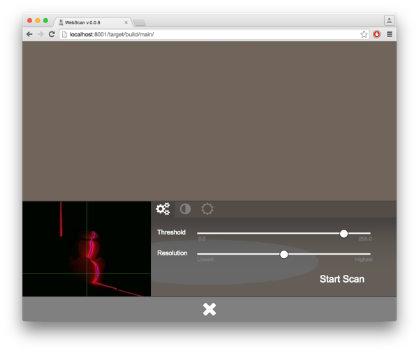

# FabScan PI - An Open-Source 3D Laser Scanner

[](https://www.python.org/)
[](http://www.gnu.org/licenses/agpl-3.0.de.html)
[](https://travis-ci.org/mariolukas/FabScanPi-Frontend.svg?branch=master)


## What is FabScan PI

FabScan PI is the next iteration of the FabScan 3D laser scanner. It uses a Raspberry PI and the Raspberry PI
camera module. The idea behind using a Raspberry Pi is to provide the same hardware setup for all FabScans.
Another benefit is that the FabScan gets a Stand-Alone, Web-Enabled 3D laser scanner.

The FabScan PI Server is written in Python. The Web-Enabled user inferface is written in Python. The code for 
the interface can be found at: http://github.com/mariolukas/FabScanPi-Frontend
That enables people with different programming skills to [contribute to this project](Readme.md#contribute).

FabScan PI is Free Software and released under the [GNU Affero General Public License V3](http://www.gnu.org/licenses/agpl.html).

## Installation 

* [Hardware](doc/HARDWARE.md)
* [Software](doc/SOFTWARE.md)

## Quick Start


## Notice!
There ist no need to flash the Arduino firmware. The Arduino will be flashed automatically with the current
firmware version after the server is started.


### With FabScanPI ISO image for SD card (recommended)
Dowload the current FabScanPi Raspbian image and flash it to SD Card. 
Follow the [hardware](doc/HARDWARE.md) Setup and boot the Raspberry Pi 2 
and you are ready to go. 

Latest image release: [https://github.com/mariolukas/FabScanPi-Build-Raspbian/releases/latest](https://github.com/mariolukas/FabScanPi-Build-Raspbian/releases/latest)


### With FabScanPI Raspbian Package 

```
echo "deb http://archive.fabscan.org/ jessie main" >> /etc/apt/sources.list
```

Then add the FabScan PI repository key to your key chain.

```
wget http://archive.fabscan.org/fabscan.public.key -O - | sudo apt-key add -
```

Update the package list.

```
apt-get update
```

Finish the installation with the needed packages.

```
apt-get isntall fabscanpi-server python-opencv-tbb libtbb2  python-pil python-serial python-pykka python-picamera avrdude
```

##<a name="useage"></a> Useage

FabScan Pi is tested on: 


| Logo                            | OS             | Versions     | 
|:-------------------------------:|:--------------:|:------------:|
|   | OSX, Windows   | 47.0.2526.106 (64-bit) |
|   | OSX, Windows   | 43.0.4 |


By default the FabScan PI server binds to all interfaces on port 8080. Pointing your browser to 
[http://ip-of-your-raspbrry-pi:8080](http://ip-of-your-raspbrry-pi:8080) will open the user interface. If your computer supports bonjour
you can point yout browser to [http://fabscanpi.local:8080](http://fabscanpi.local:8080), you can omit the port if you used the SD-Card
image.


Most Apple devices support bonjour by default. On Windows you can install [Bonjour Print Services for Windows 2.0.2|
(http://support.apple.com/kb/DL999). You will find more detailed information about this topic for the most common 
operating systems [here](https://learn.adafruit.com/bonjour-zeroconf-networking-for-windows-and-linux/overview).

The main view provides a camera symbol. By clicking this symbol the live settings dialog appears. On the left side
is a laser detection preview. Best scan results can be reached, when the red laser line is covered by a blue line.


The coverage of the lines can be improved by using the different slider settings. A good point to start is the 
threshold slider. If the environment light is bright, try to set a lower value. If the environment light is low, 
you should better use a higher slider value. After chnangig the slider have a look at the preview image. The video
stream leaks for a few milliseconds, sometimes up to a second (depends on the environment lighting). More advanced
settings are the camera brightness and contrast settings and if you are using an LED ring/strip of course the 
RGB light setting, which can be used to increase the objects contrast level. A scan can be performed by clicking
the scan button in the first settings tab where the threshold and resolution slider are located.



The resolution slider can be used to set the scan resolution. Sometimes it is better to start with a low resolution
to control the selected settings result. If the result is nice you can perform a higher resolution scan with the 
same settings. The current settings are persistent as long as the pi is up and running. The settings are also saved
with the scan data after a successful scan. They can be loaded to scan another object with the same settings. E.g. an 
object what consists of the same material, color etc. 


The sharing dialog can be used to handle the current loaded scan. The sharing dialog provides options to download or 
delete a scan, and as already mentioned to load the scan settings. 

Previously scanned objects can be loaded by calling the load gallery dialog. A gallery of scans appears. By clicking
one of the previously scanned objects loads the scan.


## Development

* [Frontend](doc/FRONTEND_DEV.md)
* [Backend](doc/BACKEND_DEV.md)
<a name="contribute"></a>

## Contributing to this project

Anyone and everyone is welcome to contribute. Please take a moment to
review the [guidelines for contributing](CONTRIBUTING.md).

* [Bug reports](CONTRIBUTING.md#bugs)
* [Feature requests](CONTRIBUTING.md#features)
* [Pull requests](CONTRIBUTING.md#pull-requests)

## Contributions from
* Watterott electronic
* Beckmann Mediendesign (FabScanPi Logo)
* Doug LaRue 
* Jan Thar
* Rene Bohne
* Christoph Emonds
* Jan Borchers
