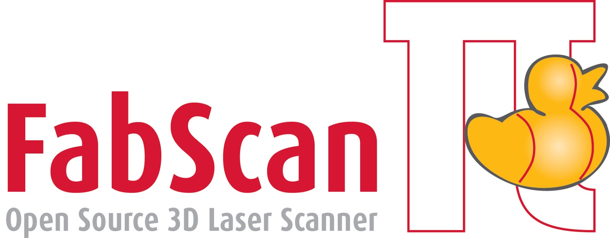

# FabScan PI - An Open-Source 3D Laser Scanner

## What is FabScan PI

The FabScan project started in 2010 at [Germany's first FabLab in Aachen](http://hci.rwth-aachen.de/fablab).The
FabScan PI is the next iteration of the [FabScan 3D laser scanner](http://hci.rwth-aachen.de/fabscan). It uses a Raspberry PI and the Raspberry PI
camera module. The idea behind using a Raspberry Pi is to provide the same hardware setup for all FabScans.
Another benefit is that the FabScan gets a Stand-Alone, Web-Enabled 3D laser scanner.

The FabScan PI Server is written in Python. The Web-Enabled user inferface is written in JavaScript and HTML5 using WebGL. The code for
the interface can be found at: http://github.com/mariolukas/FabScanPi-Frontend
That enables people with different programming skills to [contribute to this project](Readme.md#contribute).

FabScan PI is Free Software and released under the [GNU Affero General Public License V3](http://www.gnu.org/licenses/agpl.html).

## Documentation
The FabScan documentation can be found at [http://www.fabscan.org](http://www.fabscan.org)

## Core Team
* Mario Lukas (core development)
* Watterott electronic (hardware)
* René Bohne (supervision)
* Jan Borchers (supervision)

## Contributions from
* Beckmann Mediendesign (FabScanPi Logo)
* Doug LaRue
* Christoph Emonds
* Jan Thar
* Jens Hackel
* Francis Engelmann (original FabScan)
