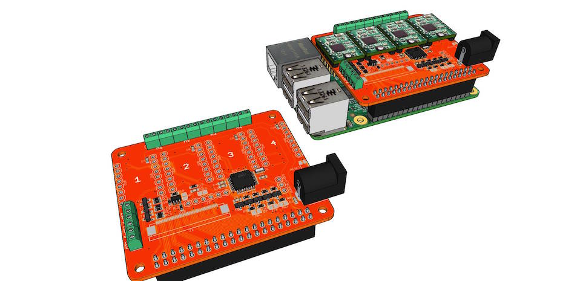

# Hardware
The FabScan PI case is the same as the FabScan (CUBE) case. The Logitech webcam is replaced by the a Raspberry PI
camera module. The Logitech webcam will also work, but it is very slow in combination with the Raspberry PI. 
The Raspberry PI camera module also provides a higher resolution what will increase the scan results. It is highly 
recommended to use a Raspberry PI 2 because of its four CPU core (FabScan PI provides multicore support). 
Connect the Arduino with the FabScan Shield mounted on it to the Raspberry PI 2 and mount the camera in front of 
the turntable. 

For a smoother turntable movement it is better to use a silent step stick motor driver. With a silent step stick 
motor driver there is no need to glue the object to the turntable. It will not slip/slide anymore.

It is possible to get better scan results by mounting a RGB LED Ring or LED strip (WS2812 or compatible) beside the 
camera module. The LED ring/strip is connected to the 3 pinned header between the sockel for the fourth motor driver.
The "S" pin goes to DI of the LED ring/strip.

Finally connect the 5V power supply to the Raspberry PI 2 and the 12V power supply to the Arduino. Turn both on.

### Part List ###

All needed parts can be purchased at: [http://www.watterott.com](http://www.watterott.com)

* Raspberry Pi 2: [http://www.watterott.com/en/Raspberry-Pi-Modell-2](http://www.watterott.com/en/Raspberry-Pi-Modell-2)
* Raspberry Pi camera module: [http://www.watterott.com/en/Raspberry-Pi-Kamera-Board](http://www.watterott.com/en/Raspberry-Pi-Kamera-Board)
* Raspberry camera module cable extension
* Arduino/Genuino UNO: [http://www.watterott.com/en/Genuino-Uno-Rev3](http://www.watterott.com/en/Genuino-Uno-Rev3)
* FabScan Arduino Shield: [http://www.watterott.com/en/Arduino-FabScan-Shield](http://www.watterott.com/en/Arduino-FabScan-Shield)
* Silent Step Stick motor driver: [http://www.watterott.com/en/SilentStepStick](http://www.watterott.com/en/SilentStepStick)
* FabScan Case: [http://www.watterott.com/en/Fabscan-CUBE-Kit](http://www.watterott.com/en/Fabscan-CUBE-Kit)
* Red line laser module: [http://www.watterott.com/en/5mW-Linienlaser-rot](http://www.watterott.com/en/5mW-Linienlaser-rot)
* 5V Power Supply ( Raspberry PI ): [http://www.watterott.com/en/HNP15-USB](http://www.watterott.com/en/HNP15-USB)
* 12V Power Supply ( Arduino and Shield ): [http://www.watterott.com/en/Netzteil-12V-2A](http://www.watterott.com/en/Netzteil-12V-2A)

There will be a release of the official FabScan PI - HAT soon. This HAT replaces the Arduino and the FabScan Arduino 
Shield. Another benefit of using the FabScan HAT is that the whole setup needs only one 12V power supply. 

