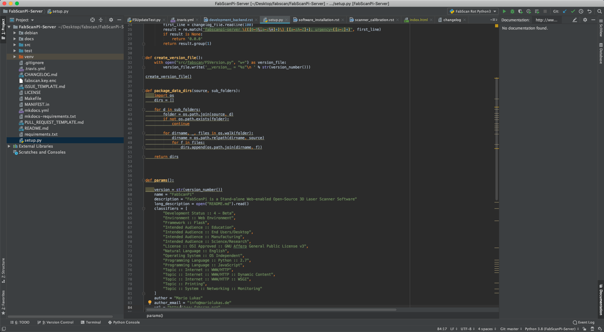
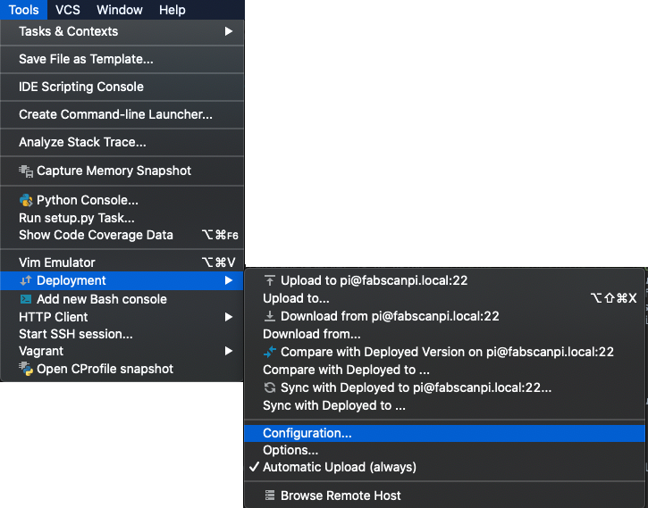
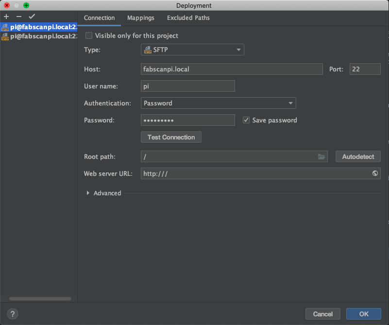
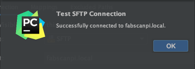
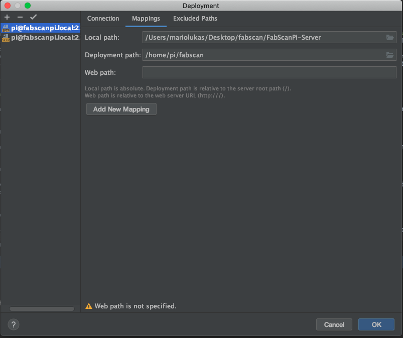
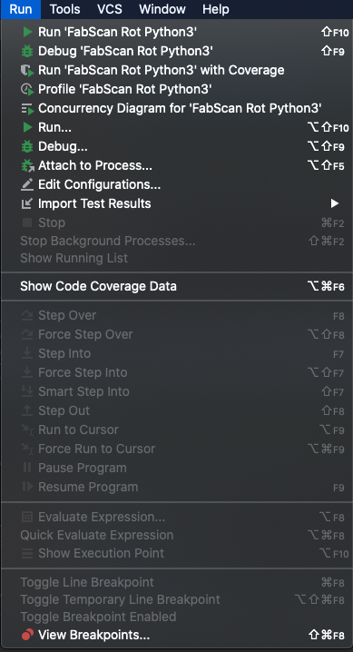
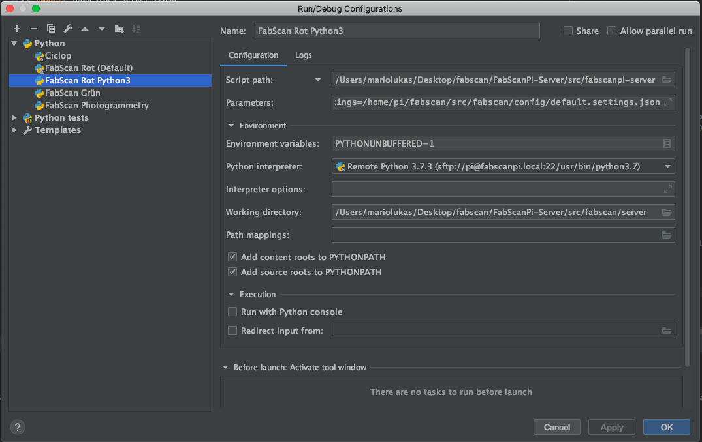
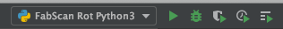
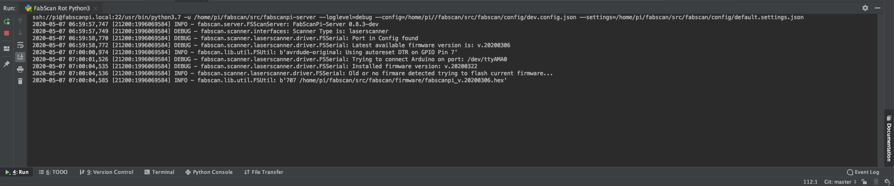

.. _development_backend:

****************
FabScanPi-Server
****************

Setting up a Development environment
------------------------------------

Before you can start developing the FabscanPi-Server some basic configurations are needed.

    * Prerequisites:

        * `Python 3.7 <https://python.org>`_
        * `Git <https://git-scm.com>`_

Obtaining the code
------------------

  Checkout the FabScanPi-Server sources from their Git repository. The default branch is already the development branch.

  .. code-block:: bash

      git clone https://github.com/mariolukas/FabScanPi-Server.git

  Afterwards you can change into the directory FabScanPi-Server. If you need to work on an other branch you can checkout
  that specific branch.

  .. code-block:: bash

    git checkout master

IDE Setup
---------

The most convenient way to start developing on FabScanPi-Server is by using `Jetbrains PyCharm <https://www.jetbrains.com/pycharm>`_ .
PyCharm comes in two versions one is the Community Edition the other is the Professional one. We recommend to use the Professional,
because it offers two very important features which will make developing on remote hardware less painful. The first feature is
remote code execution, the second one is auto deploying the code to the remote system. Also remote debugging is really helpful. Anyway
you can also use the community edition but a lot of steps need to be done manually. PyCharm is available for Windows, MacOS and Linux.

    * Prerequisites:

        * `PyCharm Professional <https://www.jetbrains.com/pycharm/download/>`_

After the installation you need to start PyCharm. It is important for further steps that you already checked out the FabScanPi-Server
source.

.. image:: images/dev-server-1.png

You will see the PyCharm Welcome window. Just click on the Open folder icon and select the FabScanPi-Server folder which you recently
checked out by git.

PyCharm will open the project and you are ready to setup the project environment. For the next steps it is important that your FabScan
is already assembled and connected to your local network. You also need to know the ip address of your FabScan.

First you need to setup the auto deployment feature of PyCharm ( only in Professional). If you are using the Community Edition of PyCharm
you have to find a way on how you can copy the code to the Raspberry Pi after you changed it.

Go to the Tools Option in the Navigation Bar on the top of the window. And select the entry "Deployment" in the submenu choose "Configuration"

The delpoyment configuration window opens up. Choose the "+" icon for adding a new SFTP connection. Configure the connection like the image below shows.
Fill the host field with the IP address of your Raspberry Pi. You can also use fabscanpi.local if your operating system is able to handle the zeroconf protocol.
Username is pi and password is raspberry. You can test the connection by clicking on the "Test Connection" button.

A working connection is confirmed by a small window, which you can confirm by clicking ok.

Next you need to setup the folder mappings for the code on the destination system. Choose your local path. The local path is the path where
the FabScan code is located.

Next choose the path to where the code should be deployed. It should be deployed to a subfolder in the pi users home directory. The web path can be left empty
it is not needed for FabScan development.

If your upload is running you need to activate the "Automatic Upload". You can find this option in Tools->Deployment->Automatic Upload. It is always a good idea to
upload the code manually for the first time by clicking on Tools->Deployment->Upload To...

Next you need at leat to configure one run configuration. Go to the "Run" menu and choose "Edit Configurations". The configuration dialog opens...

You can add different run configurations for all kinds of FabScan config files. But you need at least one configuration. You should start with a basic
default configuration. There is already a configuration file for developing. dev.config.json.

First click on "+" for adding a new run configuration. Just choose Python. Now you need to configure the run configuration. First choose a name like "Fabscan default"
or something else.

The script path entry needs to point to the local folder "src/" and the file "fabscanpi-server". This is the entry point to start the FabscanPi-Server application.
The Parameters should be set to

.. code-block:: bash

    --loglevel=debug --config=/home/pi//fabscan/src/fabscan/config/dev.config.json --settings=/home/pi/fabscan/src/fabscan/config/default.settings.json

where you can choose a log level (debug is just fine :) ). The config parameter points to the configuration file you want to use for your developing. For the first
development experiences dev.config.json is a goof choice. The settings can be set to default.settings.josn. The settings define the presets for the FabScan-Frontend settings dialog.

You need to choose your Python interpreter. Default should be Python3. Confirm the configuration by closing the dialog with the "Ok" button.

Now you can try to start the FabScanPi-Server by clicking on the green start arrow in the top right of the window. Be sure that you selected your recently created run configuration.

The server will start up. You can see the progress in the Run section in the bottom area of PyCharm window.

The Symbols on the left side can be used to stop, start, restart the process. Point your browser to the ip address of your
FabScan and you are ready to use your local code.

Building the Debian Package
---------------------------

Building the FabScan PI software depends on some python libraries. You need to install pyserial, pykka, opencv with tbb support
and picamera. The easiest way to install all dependencies is to use debians package manager apt. You need to add the
fabscan repository to your apt source list because FabScanPi brings its own build of the opencv library. The reason ist that the
official builds do not support the usage of multicore.

Build Debian package
Install dependencies

.. code:: bash

    sudo apt-get install build-essential dpkg-dev debhelper devscripts fakeroot cdbs python3-setuptools dh-python3 python3-support

Clone Repistory

.. code:: Bash

   git clone https://github.com/mariolukas/FabScanPi-Server.git
   cd FabScanPi-Server

The package is built by calling

.. code:: bash

    make deb

The best way to build the package is using a raspbian operating system. So do it within a Raspbian installation.
Crosscompilers or Docker containers should also work.

Afterwards the package can be installed by

.. code:: bash

    dpkg -i fabscabpi-server<package-version>.deb

Using the current testing branch
--------------------------------

It is possible to use the latest released testing release of the FabScanPi-Server. All you need to do is switching the
source list to the testing repository.

.. code:: bash

    sudo nano /etc/apt/source.list.d/fabscanpi.list

Then change the stable entry to testing and save the file.

.. code:: bash

    deb http://archive.fabscan.org/ testing main

Now you need to update the packages and upgrade to the latest testing version.

.. code:: bash

    sudo apt-get update && sudo apt-get dist-upgrade

The FabScanPi-Server user interface will show a version number with a postfix which is introduced by '+'.
The plus indicates that you are using a testing build. The numbers behind the plus is the build date
( e.g. v.0.9.2+202007072120 )

