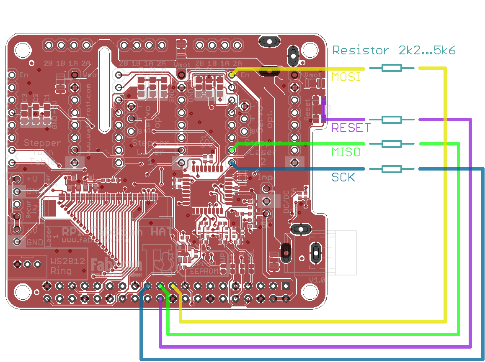
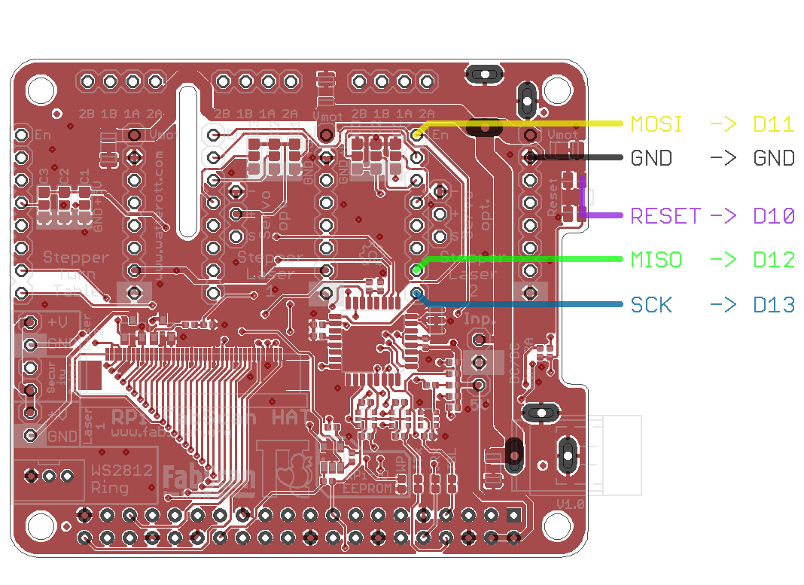

**[Software](#software)**

**[Hardware](#hardware)**

**[Scanning Issues](#scanningIssues)**

**[Other](#other)**

------

# Software<a name="software"></a>

- **What username and password do I need for login the FabScanPi?**

  The username / password is the same as in the standard raspbian configuration: 

  Username: **pi** <br/>
  Password: **raspberry**

  ​

- **Do I have to perform the calibration every time when I restart my FabScanPi?**

  No, the calibration data will be stored. We recommend to perform a calibration every time when the FabScanPi has been shipped, modified or the scan results show signs of deformation.

  ​

- **The calibrations fails every time. What can I do?**

  The laser and the LED-light are needed for the calibration, they must be installed and be able to work. Make sure the box is closed during calibration so that no external light can cause problems. 

  ​


- **Where can I find the calibration file?**

  You can find it in the folder: ```/etc/fabscanpi```

  The config file is named : ```default.config.json```


- **Where can I find the initial settings of the LED-light, Camera brightness, contrast and saturation?**

  You can find it in the folder: ```/etc/fabscanpi```

  The config file is named : ```default.settings.json```

  ​

- **Where can I find the log file?**

  You can find it in the folder: ```/var/log/fabscanpi```

  The config file is named : ```fabscanpi.log```

  ​


- **How can I view the log file?**

  You can see the log file on screen by typing:

    cat /var/log/fabscanpi/fabscanpi.log

  ​


-  **How can I edit the log file?**

  You can edit the log file with the nano editor by typing:

    sudo nano /var/log/fabscanpi/fabscanpi.log

  To save the file press "Ctrl+O" followed by "enter".

  To exit the nano editor press "Ctrl+X".

  ​

-  **How can I stop / start the FabScanPi server?**

  You can stop the server from the console by typing:

    sudo /etc/init.d/fabscanpi-server stop

  or to (re) start:

    sudo /etc/init.d/fabscanpi-server stop  

  ​


- **How can I use the latest (probably unstable) software?**

  You must edit the repository settings in the sources list in the console by typing:

     ```sudo nano /etc/apt/sources.list```

  ​

  Add a new line to the sources.list that it looks exactly like this:

  ```deb http://archive.fabscan.org/ testing main```

  ​

  Add a hash sign (#) in front of the already existing 'fabscan.archive.org' line so that it looks like:

  ```# deb http://archive.fabscan.org/ jessie main``` 

  or

  ```# deb http://archive.fabscan.org/ stable main```

  INFO: The '#' disables the packet sources in the line

  ​

  

  NOTE: In newer images the entry is called ```stable``` instead of ```jessie```

  This will change the update source to the testing directory. 

  NOTE: To switch back to the official release you need to remove the # from the 2nd line and place it in front of the 3rd line.

  To save your changes press CTRL + O, then ENTER and exit with CTRL + X

  ​

  Now do an update and dist-upgrade:

    $ sudo apt-get update
    $ sudo apt-get dist-upgrade

  ​

  Finally you should reboot the FabScanPi:

    $ sudo reboot now

  ​

  Alternatively you can switch off - switch on your FabScanPi

  ​

  NOTE: Now you will use the testing data source. Because it is not officially released there will be NO SUPPORT for this version.

  ​

- **How can I switch back to an older version (stable) of the software?**

  You must know the number of the older version you want to step back to (e.g.: 0.4.0-b373) :

  Open a console (or remote ssh-console).

  Type in: ```sudo apt-get install fabscanpi-server=0.4.0-b373```

  Follow the questions in the installation procedure and finally restart the FabScanPi again.

  NOTE: Please make sure you selected the correct packet source in the ``` /etc/apt/sources.list```

  ​


# Hardware<a name="hardware"></a>

-  **What power source(s) do I need to get my FabScanPi working?**

   The FabScanPi will need 12V DC and 5V DC. There are different options to fulfil this requirement:

**Option A:** Connect 12V DC to the HAT (round connector) and install a 12V DC - to - 5V DC regulator on the designated space on the HAT. 

NOTE: For details and specifications please consult the hardware chapter.

**Option B:** Connect 12V DC to the HAT (round connector) and 5V DC to the raspberry (micro USB 								connector). 

NOTE: Make sure you switch on the both power sources at the same time to avoid software trouble.

**Option C:** Connect 12V DC to the HAT (round connector) and connect a 5V DC power source to the 5V pin regulator pin on the HAT. 

NOTE: For details and specifications please consult the hardware chapter.

- **What is the rotating direction of the scan table?**

   It should move clockwise – if not please consult the hardware chapter of our documentation and check the connection of your stepper.

- **Which camera will work?**

   FabScan Pi can be built with both Raspberry Pi Camera Modules V 1.x or V 2.x.

- **I have a Raspberry Cam Module with NoIR. Can I use it?**

   There’s no advantage in using the NoIR cam. The algorithms for the laser detection are made for the normal cam. Therefore we recommend to use the normal camera modules.

- **Is the LED-Ring / PCB-board with LEDs mandatory?**

   Yes, because the light is needed to perform the calibration. It is also necessary to archive good quality texture scans.


- **Which LED-ring is compatible?**

   Any ring using WS2812B LEDs (or compatible) will do. To avoid problems with the calibration we suggest using the FabScanPi LED-board.


- **My servo stepper / servo isn't working**

   There is no implementation for the servo/stepper to move the laser until now.


- **No connection to Arduino, how can i fix that?**

   First you need to find out more about the problem. Have a look to the log file (see "How can i view the log file?" in F.A.Q.). 
   Find the section where the init sequence of the server starts. Look for the folowing line ... 

  ```
  fabscan.server - INFO - FabScanPi-Server 0.4.2
  ```

   If the next lines look like the the debug output below, the fabscanpi-server is not able to flash the firmware 
   to the FabScanPi-HAT (or Arduino).

	fabscan.scanner.laserscanner.FSSerial - ERROR - No FabScanPi HAT or compatible device found on port /dev/ttyAMA0

	fabscan.scanner.laserscanner.FSSerial - ERROR - Fatal FabScanPi HAT or compatible connection error....

	fabscan.scanner.laserscanner.FSHardwareController - DEBUG - Reset FabScanPi HAT...

	fabscan.scanner.laserscanner.FSSerial - ERROR - 'NoneType' object has no attribute 'write'

	fabscan.scanner.laserscanner.FSSerial - DEBUG - 'NoneType' object has no attribute 'readline'

	fabscan.scanner.laserscanner.FSSerial - ERROR - 'NoneType' object has no attribute 'write'


   If this error occurs by the first run please start reading with 1. In case this error occurs after an fabscanpi-server update 
   and your software worked before, continue reading with 2. 

----

      1. First double check the solder joints of the 40-pin Header of the FabScanPi-HAT. If you are sure that there are no 'cold' solder joints move on 
        reading, otherwise resolder those joints. Try again and have a look to the logs. If the error still occurs continue reading with 3.

      2. Check if your fabscanpi-server version is 0.4.2 or higher. Have a look into your default.config.json and check the serial baudrate. It should be 57600 for fabscanpi-server >= 0.4.2. 
        If you changed the baudrate and the error still occurs continue with reading 3. 

      3. Your bootloader is bricked, what means that you need to flash a new bootloader to your FabScanPi HAT. Continue with reading "How to flash the FabScanPi HAT Bootloader?"


----

- **How to flash the FabScanPi HAT Bootloader?**


  **Option A: Using Raspberry Pi for flashing.**

  Connect the FabScanPi HAT pins as described below. (solder some wires to the solder pads). Use a resistor 2k2...5k6 in series for every signal. (see picture for details)

```
RPi  -> Target
IO25 -> Reset
IO11 -> SCK
IO10 -> MOSI
IO9  -> MISO
GND  -> GND
```

  >
  >  Download bootloader:


    $ wget https://github.com/watterott/RPi-UNO-HAT/raw/master/docu/bloader.hex
 

  Edit the file ```avrdude.conf``` and add the following lines:

    $ sudo nano /usr/local/etc/avrdude.conf

    programmer
      id    = "pi_isp";
      desc  = "GPIO bitbang";
      type  = "linuxgpio";
      reset = 25;
      sck   = 11;
      mosi  = 10;
      miso  = 9;
    ;

  Flash bootloader:

    $ avrdude -c pi_isp -p m328p -e -U flash:w:bloader.hex:i -U lfuse:w:0xFF:m -U hfuse:w:0xD6:m -U efuse:w:0x05:m -U lock:w:0x0F:m

**Option B: Using Arduino Uno (device ```ttyACM0``` or ```ttyUSB0```) for flashing.**

  Connection (Arduino Uno connected to RPi via USB):

```
Uno -> Target
D10 -> Reset
D13 -> SCK
D11 -> MOSI
D12 -> MISO
GND -> GND
```

  
​	
  Download bootloader and ISP firmware:

    $ wget https://github.com/watterott/RPi-UNO-HAT/raw/master/docu/bloader.hex
    $ wget https://github.com/watterott/RPi-UNO-HAT/raw/master/docu/isp.hex

  Flash ISP firmware to Arduino Uno:

	$ avrdude -c arduino -P /dev/ttyACM0 -b 115200 -p m328p -e -U flash:w:isp.hex:i

  Flash bootloader:

    $ avrdude -c stk500v1 -P /dev/ttyACM0 -b 19200 -p m328p -e -U flash:w:bloader.hex:i -U lfuse:w:0xFF:m -U hfuse:w:0xD6:m -U efuse:w:0x05:m -U lock:w:0x0F:m
​    

#### Scanning issues<a name="scanningIssues"></a>

- **The turntable is jerking during the scan process what can I do?**

  This behavior is quite normal because every time a new image has been shot the table just moves to the next position. If the table is turning smoothly (clockwise) during scan preview everything should be fine.


- **My scan is cut-off on top and / or bottom. What can I do?**

  Try to optimize your scan results by measuring the "origin_distance" of your calibration sheet. Correct the value in the configuration. Make sure the size of the black squares on your calibration sheet as the same as "square_size" in the calibration file.


- **The texture scan is mirror-inverted.** 

  Check the rotating direction of your turntable (and the connection of the stepper motor). Check and adjust your config-settings for the “dimension”-value.


- **The laser cannot be detected.**

  Make sure your laser adjustment is correct. The laser must pass the scanning table right through the center. If no object is on the table the laser should be visible in the preview image (on the rear wall close to the left border of the image).


- **The scans don’t have the same shape as the original.**

  Check if your laser is aligned in vertical direction. Do another calibration.


- **Calibrations fails / no "Calibration finished" message is displayed**

  Check the starting position of the calibration sheet and make sure your box is closed during the scan. The calibration sheet must be placed with a black square in the upper left corner.


#### Other<a name="other"></a>

tbd.
