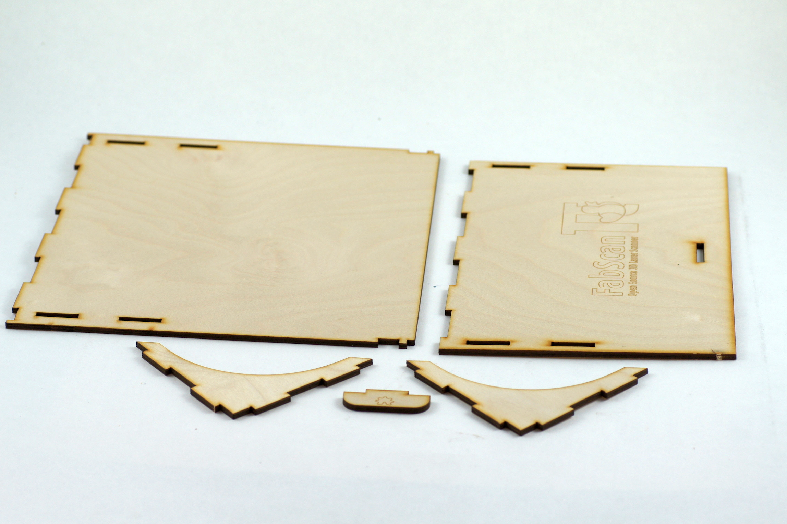
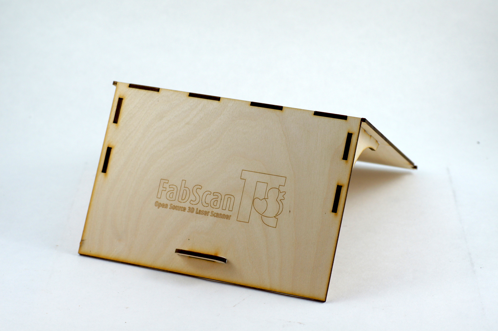
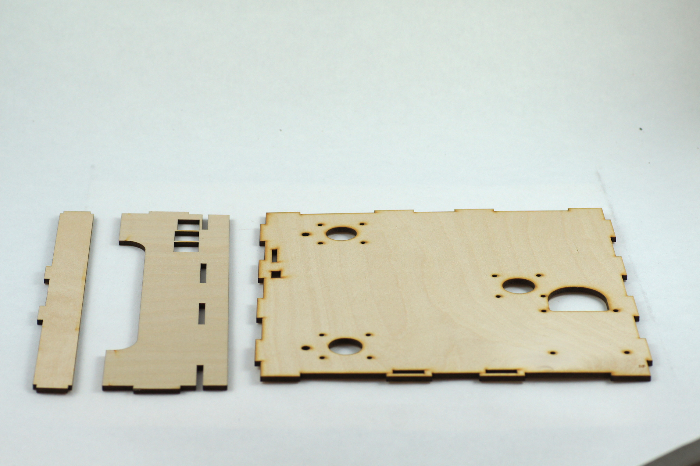
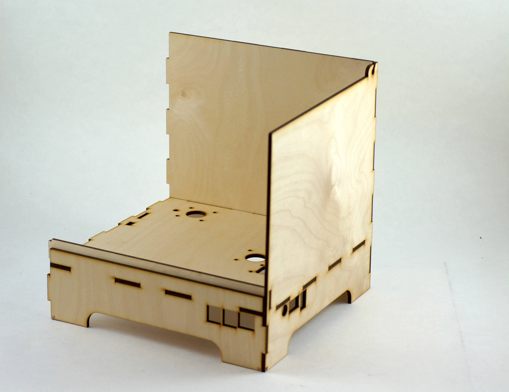
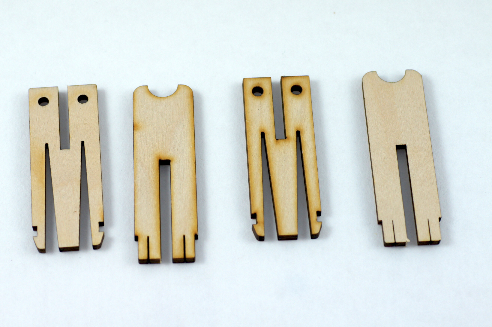
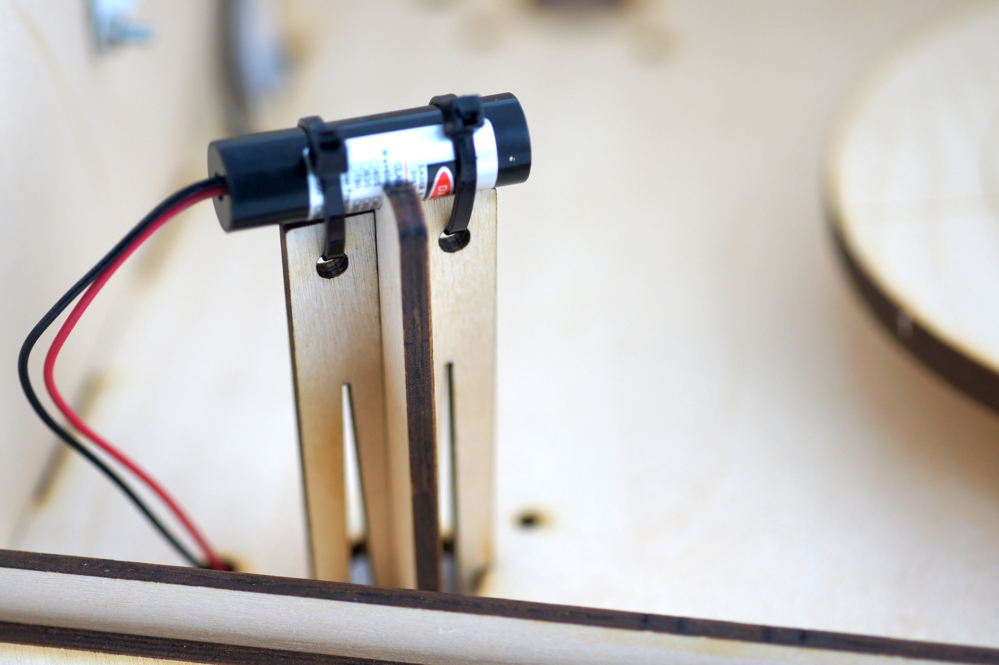

.. _hardware_enclosure

********
The Case
********

Lid Assembly
------------

**Step 1:**

**Step 2:**

.. image:: images/case_step_2.jpg
   :width: 600

**Step 3:**

.. image:: images/case_step_3.jpg
   :width: 600

**Step 4:**

.. image:: images/case_step_4.jpg
   :width: 600

**Step 5:**

Cabinet Assembly
----------------

**Step 6:**

**Step 7:**

.. image:: images/case_step_7.jpg
   :width: 600

**Step 8:**

.. image:: images/case_step_8.jpg
   :width: 600

**Step 9:**

**Step 10:**

.. image:: images/case_step_10.jpg
   :width: 600

**Step 11:**

.. image:: images/case_step_11.jpg
   :width: 600

Laser Mount Assembly
--------------------

**Step 12:**

**Step 13:**

.. image:: images/case_step_13.jpg
   :width: 600

**Step 14:**

