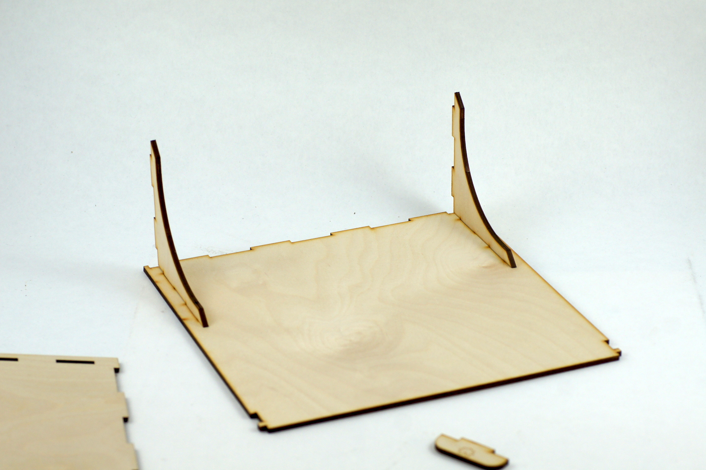
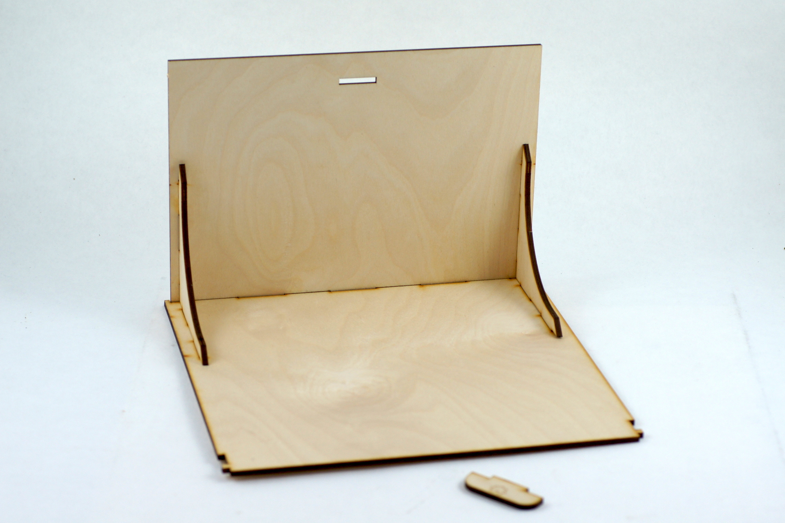
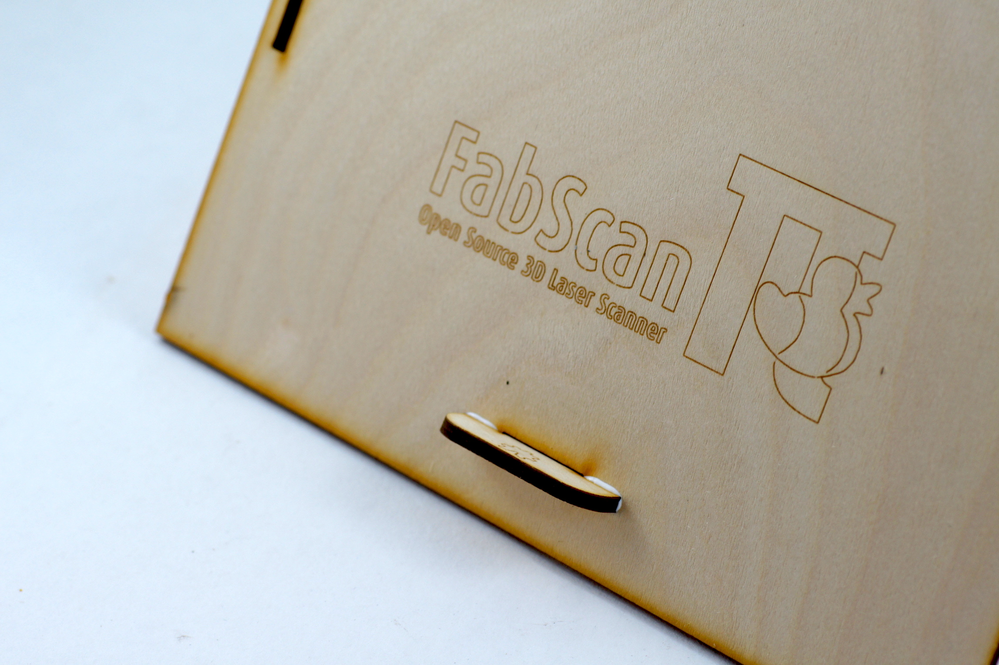
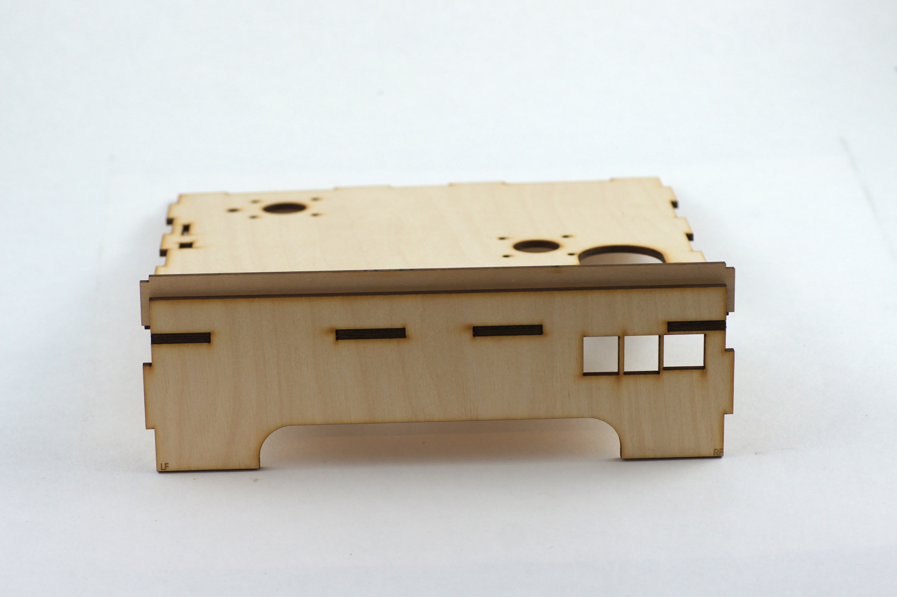
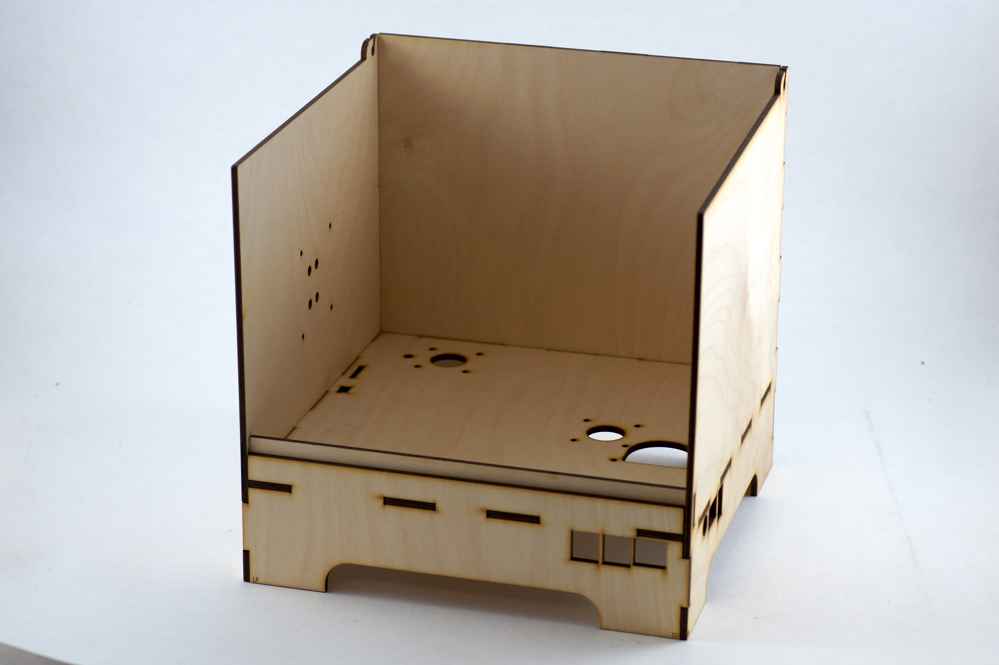
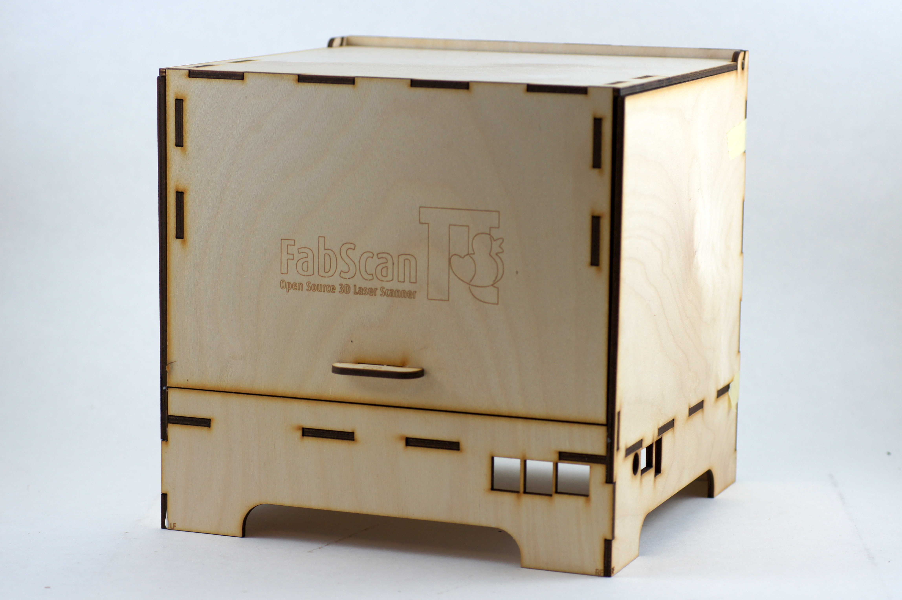

.. _hardware_enclosure

********
The Case
********

Lid Assembly
------------

**Step 1:**

.. image:: images/step_1.JPG
   :width: 600

**Step 2:**

**Step 3:**

**Step 4:**

**Step 5:**

.. image:: images/step_5.JPG
   :width: 600

Cabinet Assembly
----------------

**Step 6:**

.. image:: images/step_6.JPG
   :width: 600

**Step 7:**

**Step 8:**

.. image:: images/step_8.JPG
   :width: 600

**Step 9:**

.. image:: images/step_9.JPG
   :width: 600

**Step 10:**

**Step 11:**

Laser Mount Assembly
--------------------

**Step 12:**

.. image:: images/step_12.JPG
   :width: 600

**Step 13:**

.. image:: images/step_13.JPG
   :width: 600

**Step 14:**

.. image:: images/step_14.JPG
   :width: 600
