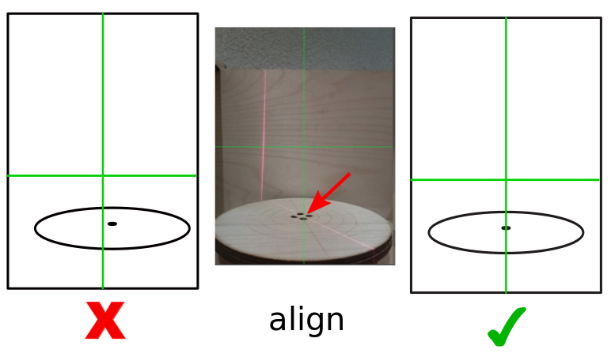
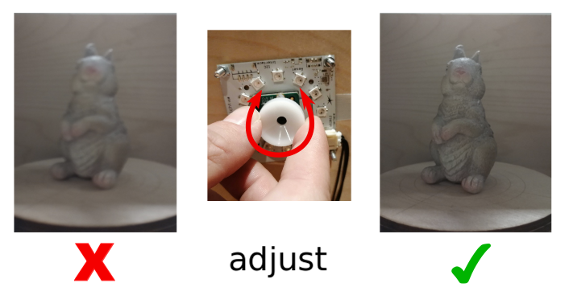
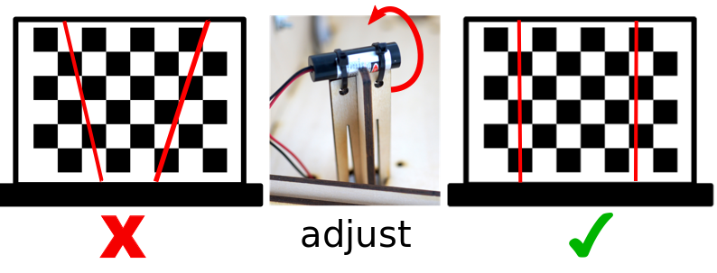
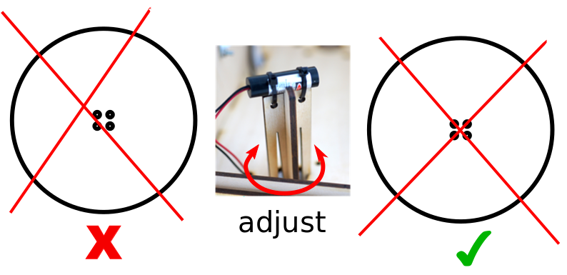
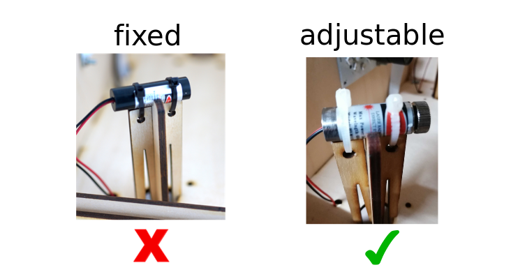
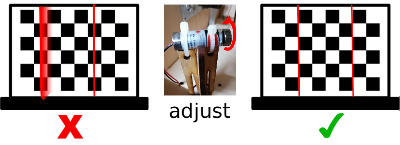
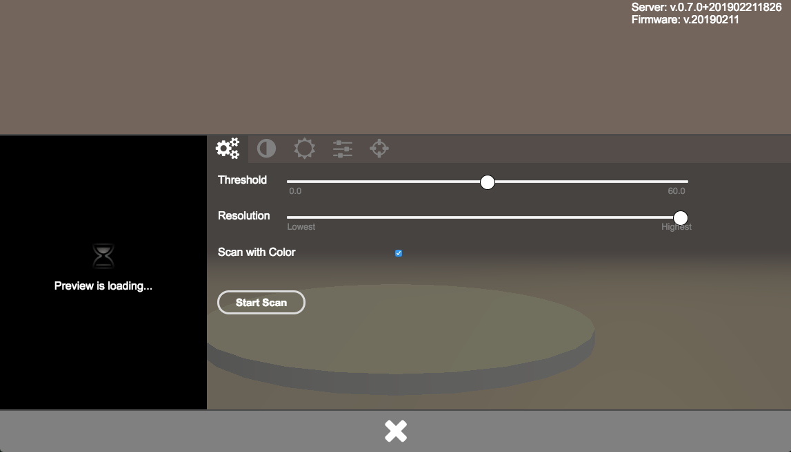
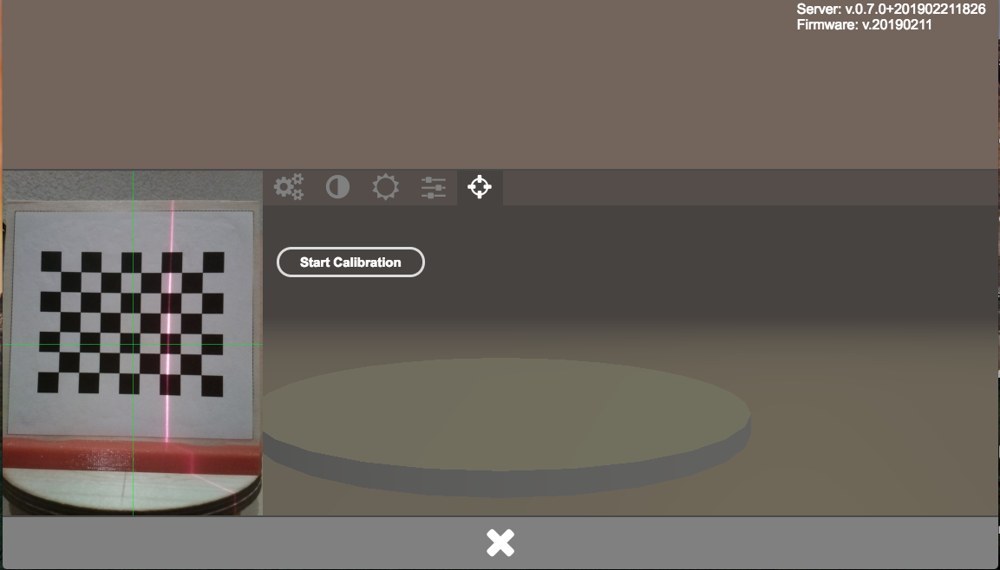

.. _scanner_calibration:

Prepare for Calibration
-----------------------

Before you can start with your first scans you must perform a calibration. That is necessary because every Scanner housing is a bit different.  By calibrating your scanner the software will get the exact parameters of your FabScanPi. You will have to do the calibration only once, the gathered data will be stored. But we recommend to do a calibration every time when the FabScanPi has been shipped, modified or when the scan results look distorted.

.. note:: A successfull calibration is the key for getting good scan results.

First you need to be sure, that some requirements fit. Especially when you are planing to use two instead of only one laser. The following simple
adjustments can improve your calibration quality a lot.

Camera Alignment
~~~~~~~~~~~~~~~~

**Horizontal Camera Position**

The camera should be alined to the center of the turntable. You can use the green cross overlay in the image as a reference for
the center of the image. You can push gently the camera lens into the direction you want.

.. note:: The camera module is glued to the pcb. It can be different form camera to camera.

**Camera Focus**

Mosty the Raspberry Pi camera is not in focus by default ( `espesically V2 <https://www.jeffgeerling.com/blog/2017/fixing-blurry-focus-on-some-raspberry-pi-camera-v2-models>`_)
There are several ways to fix that. The easiest option is to use the white piece of plasic which is delivered wiht almost every Raspberry Pi cam since a
few years. You can stick it on top of the cam and adjust the focus by turning it. It has a hole in the middle so that you can see changes in realtime if you
are running a live stream.

.. note:: Build your own tool if you don't have the adjustment ring anymore. There are a lot of 3d printable wrenches for the Raspberry Pi camera on thingiverse. `https://www.thingiverse.com/thing:1570865 <https://www.thingiverse.com/thing:1570865>`_

Laser Alignment
~~~~~~~~~~~~~~~

**Vertical Laser Alignment**

The lasers should hit the calibration sheed in a vertical direction. As close to 90 degree as possible. You can rotate the laser
module to adjust the vertical laser alignment.

**Hozizonatal Laser Alignment**

The lasers should cross the center of the turntable. You can rotate the laser mount to adjust the laser poistion on the turntable.

**Laser Focus**

This step depends on your laser. If you are using a laser with adjustable focus (right image), you should follow this step.
When your laser has a fixed focus (left image) continue with `Start Scanner Calibration`_.

Turn the focus ring on the laser until you get a the sharpes possible line. If you are using two lasers, do it for both.

Start Scanner Calibration
-------------------------

The calibration will be done by scanning an calibration sheet with a specific pattern which must be placed on the turntable. The pattern must face the camera:

.. image:: images/calibration_start_position.jpg

Option 1: You can can build your own calibration tool from cardboard. Print the calibration sheet onto paper and glue it to cardboard. Build a stand of another piece of cardboard. Maybe you have to fix the calibration sheet on the turntable by using some adhesive tape.

Option 2: You have an 3D-printer available and can print out our calibration sheet holder. There's also a different calibration sheet for external holder use.

.. note:: To get a perfectly flat and stable surface glue the calibration sheet on a piece of thick pcb (printed circuit board).

 `Download calibration mount and sheet! <https://github.com/mariolukas/FabScan-Case/tree/master/calibratio>`_

Version V1 and V2 have the same size. Both will fit. But V2 is more printer friendly.

.. note:: Please check if your print of the calibration sheet has the correct scale. Each black square should have the same side length as stated on the calibration sheet (e.g.11 mm (1,1 cm). If the size is not correct please correct the parameter "pattern square size" in the configuration file.

You can find all details in the chapter :ref:`How to Edit the Config File` .

Place the calibration sheet on the turntable facing the camera. See `here <configuration.html#how-to-edit-the-config-file>`_

.. image:: images/calibration_start_position.jpg

Please close the box to avoid external light sources to impact the calibration process. Start  your browser and call http://ip-of-your-raspberry-pi:8080 which will open the user interface.

When you start your FabScanPi for the first time you will see an information in the upper left corner that you have to perform a calibration.

.. image:: images/Manual_NoCalibration_1.jpg

Click on the duck icon to open the settings dialog.

Select the calibration tab. It is the one with the crosshair icon.

Click on the "Start Calibration" Button. The calibration starts immediately.

An information "Calibration started" will be displayed in the upper left corner.

.. image:: images/Manual_2a.jpg

The calibration may need several minutes. During the calibration an information about the remaining time is displayed.

.. image:: images/Manual_2b.jpg

When the calibration was finished successfully another notification will appear for a short time in the upper left corner.

.. image:: images/Manual_2c.jpg

Now you can remove the calibration pattern sheet from the turntable and start your first scan.

.. note:: If your scan results look not like they should, probably distorted or skewed please check the calibration data in the configuration file. You can find details about the different relevant parameters in the [Config File Values](#config-file-values) section of this documentation.
