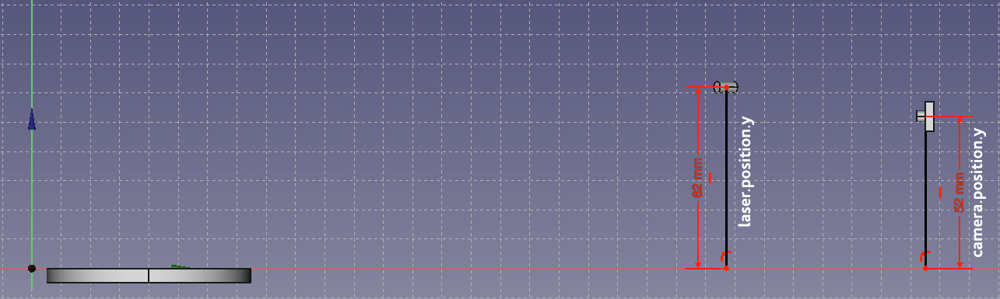
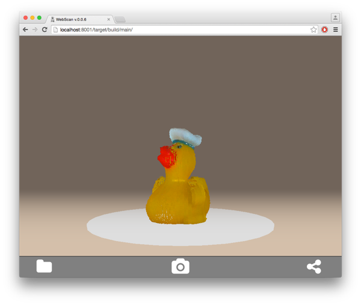

#Installation

There ist no need to flash the Arduino firmware. It will be flashed automatically with the current
firmware version after the server is started.

<span class="subheadline">Installation with FabScanPi Image (recommended)</span>


The fastest way to start working with FabScan PI is to use the FabScan PI Raspbian Image. 
Dowload the image and install it to a SD-Card. After the image is flashed and the Raspberry
Pi is up and runnig follow the instructions in the [Usage section](https://github.com/mariolukas/FabScanPi-Server/blob/master/README.md#useage)

Latest image release: 

[https://github.com/mariolukas/FabScanPi-Build-Raspbian/releases/latest](https://github.com/mariolukas/FabScanPi-Build-Raspbian/releases/latest)

The image can be build with the FabScanPi Image build script. You will find more 
information [here](developing.md#Building FabScanPi Images)


<span class="subheadline">Installing with fresh Raspbian and packages</span>

This description assumes that you have a SD card with a fresh Raspbian image on it. 

First add the fabscan repository to your source list. 

```
echo "deb http://archive.fabscan.org/ jessie main" >> /etc/apt/sources.list
```

Then add the FabScan PI repository key to your key chain.

```
wget http://archive.fabscan.org/fabscan.public.key -O - | sudo apt-key add -
```

Update the package list.

```
apt-get update
```

Finish the installation with the needed packages.

```
apt-get install fabscanpi-server python-opencv-tbb libtbb2  python-pil python-serial python-pykka python-picamera avrdude
```

The FabScan PI server can be started with 

```
sudo /etc/init.d/fabscanpi-server start
```

Read [Usage](https://github.com/mariolukas/FabScanPi-Server/blob/master/README.md#useage) section for the next steps.

<span class="subheadline">Installation: With Source Code</span>

Dependencies

FabScan PI software depends on some python libraries. You need to install pyserial, pykka, opencv with tbb support 
and picamera. The easiest way to install all dependencies is to use debians package manager apt. Some of the packages, 
like opencv with tbb support and libtbb are not provided by the official raspbian mirrors. You need to add the
fabscan repository to your apt source list. 

Build Debian package
Install dependencies

```
sudo apt-get install build-essential dpkg-dev debhelper devscripts fakeroot cdbs python-setuptools python-support
```

The package is build by calling

```
make deb
```

Afterwards the package can be installed by 

```
dpkg -i fabscabpi-server<package-version>.deb
```

# Updates
Updates can be installed with debian's apt-get package manager. Log in via ssh and check/install 
updates with the following command.


```
sudo apt-get update && apt-get upgrade
``` 


# Configuration

A configuration file can be found in /etc/fabscanpi/default.config.json. The content of this file 
is in JSON format and can be edited with an editor of your choice (e.g. nano). Be careful and don't
miss brackets. JSON is really sensitive in it's format.

<span class="subsubheadline">Folders</span>


In this section you can change the scan output folder and the folder where the ui is located. If 
you don't know what you are doing, it is a good decision to keep this section untouched.

```
   "folders" : {
    "www": "/home/pi/fabscan/src/www/",
    "scans": "/usr/local/fabscanpi/scans/"
   }
```

<span class="subsubheadline">Serial</span>

In this section you can set your port. By default this value is not set, because the
FabScanPi Server software autodetcts the correct port. Some Arduino and compatible boards differ 
in the port name. The port can be set if you are not using an Arduino UNO or compatible Board. 
In case that your Arduino is not detected and you can see an error in the /var/log/fabscanpi/fabscan.log
you should add the "port" attribute to your config.

The autoflash option is True by default, that means that the firmware is flashed automatically to 
the Arduino or FabScanPi HAT. If you want to use a custom board e.g. sanguinololu, you can set this
to False and flash the Firmware manually to your board. 
   
```
   "serial" : {
     "baudrate" : 115200,
     "port": "/dev/ttyACM0",
     "autoflash": "True"
   }
``` 


<span class="subsubheadline">Camera</span>

In this section some camera values are set. The type can be set to PICAM which is default value. There is 
also an experimental mode for a C270 webcam. But this mode is not further developed. I used it in early 
versions of fabscanpi. 

The device is not used for the PICAM. Only if a webcam is used, you have to set the device to the count number
of your webcam if you have one or more cameras connected to your pi.

Preview Resolution is the resolution value for the settings window. 
Resolution is the resolution for the picamera python module. You can have a look to the documentation of 
picamera. If you set this to other values please be sure what you are doing, not all resolutions are supported
by the picam. Some might lead to slower image capturing. 

The position values are used to define where the camera is located in the case. All values are in cm. 
Thre is an image later in this documentation which explains all the dimension related meassures. 

Frame dimension is what your camera sees in the case. An easy way to validate this value is to put a 
ruler to the backwall of the fabscan ( i used a paper one from IKEA ). Then activate the settings mode
and read the last value you can read in the image. The default is 23.5 cm. The default value fits most
of the FabScan setups. This value is used for tansforming image coordinates to world coordinates. 


```
   "camera" : {
     "type" : "PICAM",
     "device" : 1,
     "preview_resolution":{
        "width": 320,
        "height": 240
     },
     "resolution":{
          "width": 1296,
          "height":972
      },
      "position":{
          "x": 0.0,
          "y": 5.5,
          "z": 27.6
      },
      "frame":{
          "dimension": 23.5
      }
   }
```   

<span class="subsubheadline">Laser</span>

This section describes the laser position and laser stepper motor values. I mentioned position values in the section 
before (Camera), have a look at the image. 

The angle is set to the angle which was used in the last scan. The rotation_steps value should be used for a laser 
angle change (not implemented yet).Steps defines how many steps the motor can do. In the default case the motor is 
set to 1/16 step mode. A motor with 200 steps per turn can then perform 3200 steps. 

``` 
   "laser": {
      "position":{
        "x": 10.0,
        "y": 7.3,
        "z": 24.5
      },
      "angle": 33.0,
      "rotation_steps": 5,
      "steps": 3200
   }
```
   
   
<span class="subsubheadline">Turntable</span>

In this section some turntable related values are set. For positioning have a look to the image. 
Steps defines how many steps can be perfomed for a full rotation. This value depends on your motor and driver.
In the default case the motor is set to 1/16 step mode. A motor with 200 steps per turn can then perform 3200 steps.

```
   "turntable":{
     "position": {
       "x": 0.0,
       "y": 0.0,
       "z": 7.5
     },
     "steps":3200
   },
```
   
<span class="subsubheadline">Scanner</span>

This section defines global scanner related values. Origin is defined as the green horizontal line in the settings
preview window. It is a also here a good idea to keep that value untouched. Process number defines how many processes
should be used for calculating the scan data. Due the Raspberry Pi2 serves 4 cores it is a good idea to keep this
value. Increasing the proccess number does not mean inrceasing speed in all cases. 
Meshlab is not supported in the curren verision of fabscan pi. So you can leave this value. 

```
   "scanner": {
      "origin":{
        "y" : 0.75
      }
   },
   "process_number": 4,
   "meshlab":{
     "path": "/usr/bin/"
   }
}
```


For a first try the default values should be fine. But the values in your setup may be different. To be sure measure your
setup and modify the values in your default.conf.json file if needed. 

Y values


X and Z values


### Troubleshooting

Can not connect to Arduino.
Is the Arduino connected to the USB port. Check the port in your fabscanpi-server configuration
file. Try another port e.g. /dev/ttyUSB0. 
More information about changing the configuration can be found in "FabScan Pi Configuration"
section.

Camera is not connected. 
Check the cable from the Raspberry Pi to the camera module. Be careful the cable can be very
fragil. Try another camera application for checking camera functionality e.g. [raspistill](https://www.raspberrypi.org/documentation/usage/camera/raspicam/raspistill.md).


# Setting up a WIFI connection

This description explains howto setup a wifi stick for raspbian. I prefer to use an EDIMAX dongle, it worked best for me. 
First plug in your wifi dongle and log in via ssh with password "raspberry" (without quotes):

```
ssh pi@<your-fabscanpi-ip>
```
First you have to activate the wifi option in your networking setup. 

```
sudo nano /etc/network/interfaces
```

Uncomment the folling lines and save the changes. 

``` 
auto wlan0
allow-hotplug wlan0
iface wlan0 inet dhcp
wpa-conf /etc/wpa_supplicant/wpa_supplicant.conf
iface default inet dhcp
```

Now restart your network adapters. 
```
sudo nano /etc/init.d/networking
```

If you type ```sudo ifconfig``` there should be a wlan0 connection in the list. 

Your fasbcanpi image is ready to go. The only things you have to do is open wpa_supplicant.conf and 
insert your wifi ssid and your wifi secret.

```
sudo nano /etc/wpa_supplicant/wpa_supplicant.conf
```


Save the file and try to connect to your wifi by typing the following command.
```
sudo ifup wlan0
```

In some cases you have to reboot the Raspberry Pi. Check if the wifi dongle's led is bliking.
If you want to change your Raspberry Pi to a fix wifi IP address you have to change the interfaces file
to get a static wifi connection.

```
sudo nano /etc/network/interfaces
```

Change the files content from 

```
auto lo
iface lo inet loopback

allow-hotplug eth0
iface eth0 inet dhcp

auto wlan0
allow-hotplug wlan0
iface wlan0 inet dhcp
wpa-conf /etc/wpa_supplicant/wpa_supplicant.conf
iface default inet dhcp
```

to 

```
auto lo
iface lo inet loopback

allow-hotplug eth0
iface eth0 inet dhcp

auto wlan0
allow-hotplug wlan0
iface wlan0 inet static
address <ip in your network>
netmask <your netmask>
gateway <your gateway>
wpa-conf /etc/wpa_supplicant/wpa_supplicant.conf
iface default inet dhcp
```

After you changed the file you can restart your network daemon.

```
sudo /etc/init.d/networking restart
```

#Usage

FabScan Pi is tested on: 


| Logo                            | OS             | Versions     | 
|:-------------------------------:|:--------------:|:------------:|
|   | OSX, Windows   | 47.0.2526.106 (64-bit) |
|  | OSX, Windows   | 43.0.4 |


By default the FabScan PI server binds to all interfaces on port 8080. Pointing your browser to 
[http://ip-of-your-raspbrry-pi:8080](http://ip-of-your-raspbrry-pi:8080) will open the user interface. If your computer supports bonjour
you can point yout browser to [http://fabscanpi.local:8080](http://fabscanpi.local:8080), you can omit the port if you used the SD-Card
image.


Most Apple devices support bonjour by default. On Windows you can install [Bonjour Print Services for Windows 2.0.2|
(http://support.apple.com/kb/DL999). You will find more detailed information about this topic for the most common 
operating systems [here](https://learn.adafruit.com/bonjour-zeroconf-networking-for-windows-and-linux/overview).

The main view provides a camera symbol. By clicking this symbol the live settings dialog appears. On the left side
is a laser detection preview. Best scan results can be reached, when the red laser line is covered by a blue line.



The coverage of the lines can be improved by using the different slider settings. A good point to start is the 
threshold slider. If the environment light is bright, try to set a lower value. If the environment light is low, 
you should better use a higher slider value. After chnangig the slider have a look at the preview image. The video
stream leaks for a few milliseconds, sometimes up to a second (depends on the environment lighting). More advanced
settings are the camera brightness and contrast settings and if you are using an LED ring/strip of course the 
RGB light setting, which can be used to increase the objects contrast level. A scan can be performed by clicking
the scan button in the first settings tab where the threshold and resolution slider are located.


The resolution slider can be used to set the scan resolution. Sometimes it is better to start with a low resolution
to control the selected settings result. If the result is nice you can perform a higher resolution scan with the 
same settings. The current settings are persistent as long as the pi is up and running. The settings are also saved
with the scan data after a successful scan. They can be loaded to scan another object with the same settings. E.g. an 
object what consists of the same material, color etc. 


The sharing dialog can be used to handle the current loaded scan. The sharing dialog provides options to download or 
delete a scan, and as already mentioned to load the scan settings. 

Previously scanned objects can be loaded by calling the load gallery dialog. A gallery of scans appears. By clicking
one of the previously scanned objects loads the scan.
