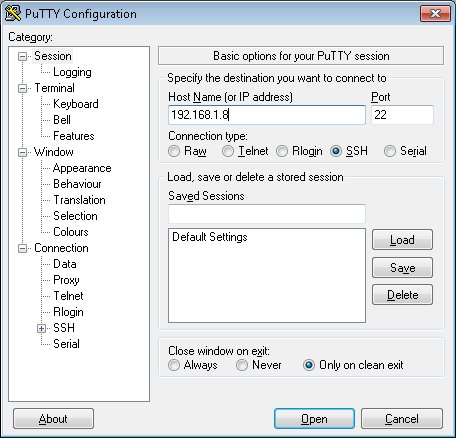
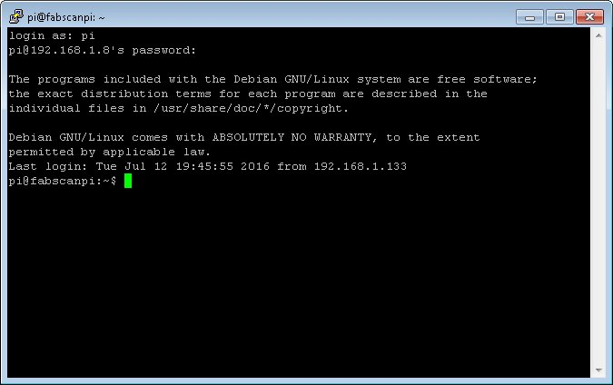
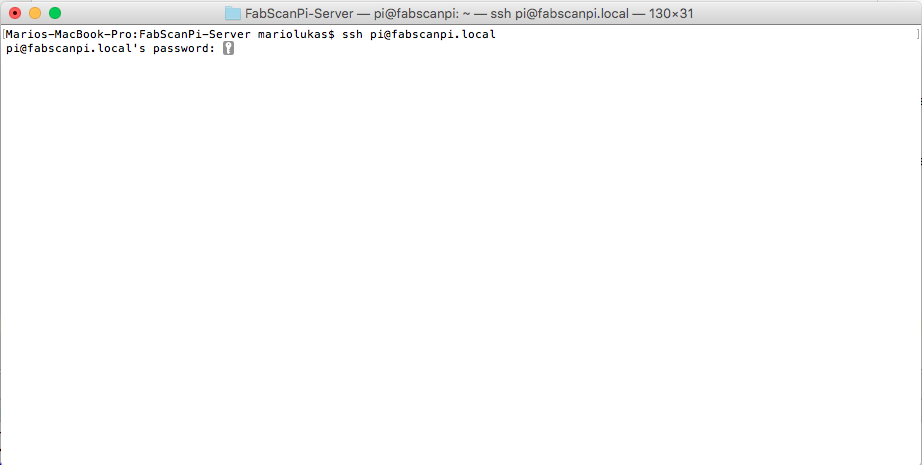
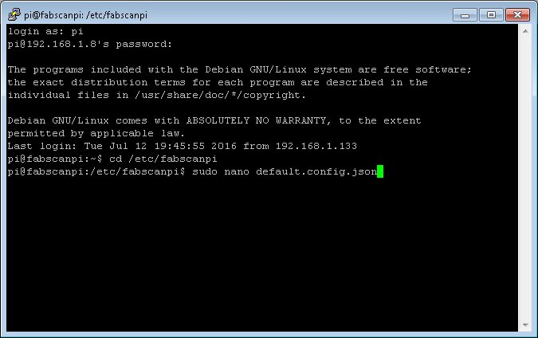
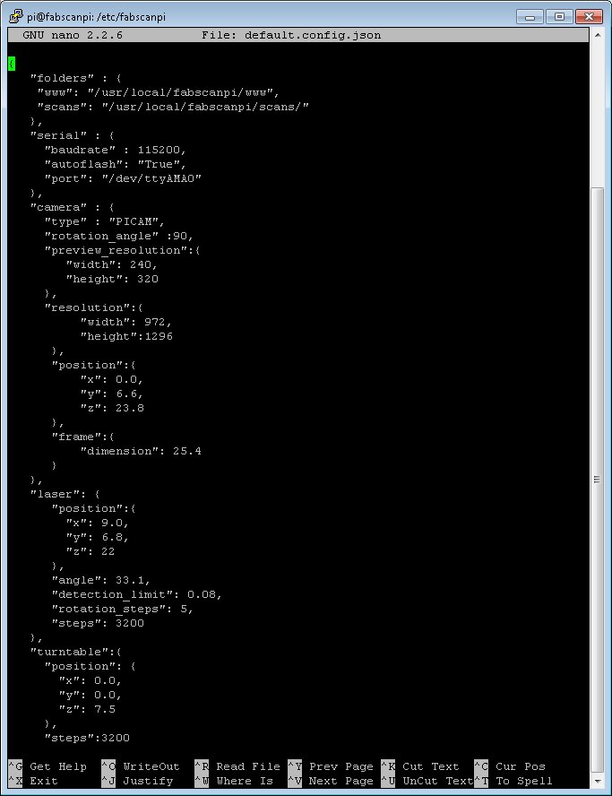
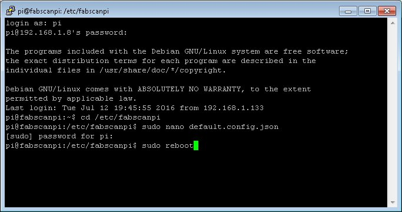

.. _software_configuration:

*************
Configuration
*************

Setting up a WIFI connection
----------------------------

This description explains howto setup a wifi stick for raspbian. I prefer to use an EDIMAX dongle, it worked best for me.
First plug in your wifi dongle and log in via ssh with password "raspberry" (without quotes):

.. code:: bash

   ssh pi@<your-fabscanpi-ip>

First you have to activate the wifi option in your networking setup.

.. code:: bash

   sudo nano /etc/network/interfaces


Uncomment the folling lines and save the changes.

.. code:: bash

   auto wlan0
   allow-hotplug wlan0
   iface wlan0 inet dhcp
   wpa-conf /etc/wpa_supplicant/wpa_supplicant.conf
   iface default inet dhcp

Now restart your network adapters.

.. code:: bash

   sudo /etc/init.d/networking restart


If you type ```sudo ifconfig``` there should be a wlan0 connection in the list.

Your fasbcanpi image is ready to go. The only things you have to do is open wpa_supplicant.conf and
insert your wifi ssid and your wifi secret.

.. code:: bash

   sudo nano /etc/wpa_supplicant/wpa_supplicant.conf


Save the file and try to connect to your wifi by typing the following command.

.. code:: bash

   sudo ifup wlan0


In some cases you have to reboot the Raspberry Pi. Check if the wifi dongle's led is bliking.
If you want to change your Raspberry Pi to a fix wifi IP address you have to change the interfaces file
to get a static wifi connection.

.. code:: bash

   sudo nano /etc/network/interfaces


Change the files content from

.. code:: bash

   auto lo
   iface lo inet loopback

   allow-hotplug eth0
   iface eth0 inet dhcp

   auto wlan0
   allow-hotplug wlan0
   iface wlan0 inet dhcp
   wpa-conf /etc/wpa_supplicant/wpa_supplicant.conf
   iface default inet dhcp


to

.. code:: bash

   auto lo
   iface lo inet loopback

   allow-hotplug eth0
   iface eth0 inet dhcp

   auto wlan0
   allow-hotplug wlan0
   iface wlan0 inet static
   address <ip in your network>
   netmask <your netmask>
   gateway <your gateway>
   wpa-conf /etc/wpa_supplicant/wpa_supplicant.conf
   iface default inet dhcp


After you changed the file you can restart your network daemon.

.. code:: bash

   sudo /etc/init.d/networking restart


Scanner Configuration File
--------------------------

.. _how-edit-config:

How to Edit the Config File
~~~~~~~~~~~~~~~~~~~~~~~~~~~

**Remote access to change the configuration settings**

It is most likely that you don't have a monitor nor mouse and keyboard connected to your FabScanPi all the time. But maybe you need to make some changes to the config file from time to time and you don't want to connect the peripherals everytime.

This can be done via a remote PC which is connected to the same network.


**Connecting as Windows User (Putty)**


First of all you need to download the tiny program "PuTTY" from http://www.putty.org/.

PuTTY is a SSH client program which establishes the connection to your FabScanPi. There is no no graphic user interface -only a console which allows only the exchange of text. But that's enough to make some changes in the config file or to update your FabScanPi-Software.

You don't need to make an installation just put the putty.exe in a folder or your desktop. Of course you can start it directly from the download folder as well.

Now you must know the IP-address which has be assigned to your FabScanPi. It is the same address you're using to get access via the webbrowser (e.g. 192.168.1.8). Usually you can check the current IP-address in the user-interface of your web-router or cable modem.

Start **Putty.exe** and a window will pop up.



Type in your IP-address in the appropriate field and click on "OPEN".



Now the console window opens and you must type in "**pi**" as **login-name** and "**raspberry**" as **password** (without the quotes). Now you should be able to see the login prompt (similar to the picture above).


**Connecting as Linux or OSX User (Terminal)**

Linux users can open a Terminal and type "**ssh pi@fabscanpi.local**"  ("**sh pi@ip-address-of-you-pi**").
Next you are asked for a password. Type in "**raspberry**" as **password** (without the quotes).
The next steps are described with screenshots for Putty, but the workflow is the same once the connection is
established.



**Changing the config file.**


The config file is in a different folder, so you must change into that folder by entering the command:

.. code:: bash

   cd /etc/fabscanpi/

and press ENTER.

To view and modify the config file (default.config.javascript) you must open it with an editor and using administrator rights to be able to save the changes into the same file. The editor which is already installed is called nano. So type in:

**sudo nano default.config.javascript**




You have to enter the password "**raspberry**" (without the quotes) again, because you open the editor with administrator rights.

The nano-editor now displays the config-file and maybe you have to enlarge the window to have a better view.

Now you can perform the desired changes by using the keyboard. To navigate you have to use the up-, down-, left- and right-key.



If you finished your modification press you can save the file by pressing and holding **CTRL** and **O** (german keyboard: STRG and O). Press RETURN to confirm the filename.

Now you can exit the editor by pressing and holding **CTRL** and **X** (german keyboard: STRG and X).

For the changes to take effect you must restart your FabScanPi by typing in the command

**sudo reboot**

and ENTER.




You can now close the PuTTY window.

The FabScanPi is rebooting and after a short time you can refresh your webbrowser and start using the FabScanPi with the new config settings.


General Values
~~~~~~~~~~~~~~


A configuration file can be found in /etc/fabscanpi/default.config.javascript. The content of this file
is in javascript format and can be edited with an editor of your choice (e.g. nano). Be careful and don't
miss brackets. javascript is really sensitive in it's format.

.. note:: The following listing snippets are only examples and may deviate from the latest settings.

**Folders**

In this section you can change the scan output folder and the folder where the ui is located. If
you don't know what you are doing, it is a good decision to keep this section untouched.

.. code-block:: javascript
   :linenos:

    "folders": {
        "www": "/usr/share/fabscanpi/",
        "scans": "/var/scans/"
    }


**Laser**


This section describes the laser stepper motor values. The numbers defines how many lasers you
are using (recommented values are 1 and 2). The color defines the color of the Laser. Green
should work also with a value of  "G (RGB)". The interleaved setting on True means that the
scanner will calculate a background difference image while it is detecting the laser. This
value on True will increases the scanning time but scanners without a case (e.g. ciclop, cowtech atlas etc.)
will work with the interleaved value on True.

.. code-block:: javascript
   :linenos:

    "laser": {
        "numbers": 1,
        "color": "R (RGB)"
        "interleaved": False
    }


If you want to use the second laser you should increase the value "numbers" to 2.

**Meshlab settings**


​In this section you can change the path for the converter which transforms the scanned pixel data into another format (e.g. .stl).

.. code-block:: javascript
   :linenos:

    "meshlab": {
        "path": "/usr/bin/"
    }


**Table settings**


In this section you can change the turntable settings. The radius of the turntable is in millimeters (mm). In the default case the motor is set to 1/16 step mode. A motor with 200 steps per turn can then perform 3200 steps. Radius is the radius of the turntable in millimeters (mm).

.. code-block:: javascript
   :linenos:

    "process_numbers": 4,
    "turntable": {
        "steps": 6400,
        "radius": 70
    }

.. note:: The default motor can perform a full turn in 400 steps, therefore the default steps value is 6400. If you are using a motor with only 200 steps per turn, change the steps value to 3200. If you don't change this, your scan will look mirrored. See F.A.Q in the forum for more information.

**Camera settings**

Preview Resolution is the resolution value for the settings window. Resolution is the resolution for the picamera python module. You can have a look to the documentation of picamera. If you set this to other values please be sure what you are doing, not all resolutions are supportedby the picam. Some might lead to slower image capturing.

.. code-block:: javascript
   :linenos:


    "camera": {
        "resolution": {
            "width": 1640,
            "height": 1232
        },
        "preview_resolution": {
            "width": 240,
            "height": 320
        },
        "rotate": "True",
        "hflip": "True",
        "vflip": "False",
        "type": "PICAM"
    }


**Serial**


In this section you can set your port. By default this value is not set, because theFabScanPi Server software autodetcts the correct port. Some Arduino and compatible boards differ in the port name. The port can be set if you are not using an Arduino UNO or compatible Board. In case that your Arduino is not detected and you can see an error in the /var/log/fabscanpi/fabscan.logyou should add the "port" attribute to your config.

The autoflash option is True by default, that means that the firmware is flashed automatically to the Arduino or FabScanPi HAT. If you want to use a custom board e.g. sanguinololu, you can set thisto False and flash the Firmware manually to your board.
​

.. code-block:: javascript
   :linenos:

    "serial": {
        "baudrate": 115200,
        "autoflash": "True",
        "port": "/dev/ttyAMA0"
    }

The default firmware flashing baudrate can be changed by adding  "flash_baudrate" to the serial settings.

**Texture illumination**


In this section you can change the pre-set brightness level of the LED-Ring during texture scan.

.. code-block:: javascript
   :linenos:

    "texture_illumination": 140
    }


**Calibration Values**
~~~~~~~~~~~~~~~~~~~~~~


In this section you can change the parameters of the configuration sheet. If your printout of the calibration sheet has not the exact scale you can adjust the parameters here instead of scaling the print.

.. note:: There is a new " 8x6 Calibration Pattern". If you are still using the old 9x6 Pattern you'll need to modify the columns value:


.. code-block:: javascript
   :linenos:

    "scanner_type": "laserscanner",
    "calibration": {
    "weight_matrix": [],
    "dist_camera_matrix": [],
    "pattern": {
        "square_size": 11,
        "rows": 6,
        "columns": 8,
        "origin_distance": 35
    }


- Square Size is the side length of one black square in millimeters.

  .. image:: images/calibration_sheet_info_2.png

- Rows and Columns are the connection points of the black squares. The correct number is 8 for columns and 6 for rows :

  .. image:: images/calibration_sheet_info_1.png


- Origin Distance is the distance between turntable surface and the upper edge of the black squares in the row close to the turntable.

  .. image:: images/Origin_Distance.jpg


**Scanner Calibration Values**


In this section you can check the calibration parameters. Please make sure you have performed the auto-calibration before starting your first scan.
Do not change these values manually. This values are generated by the autocalibration process.

.. code-block:: javascript
   :linenos:

        "camera_matrix": [
            [
                1285.5809999999999,
                0.0,
                647.60199999999998
            ],
            [
                0.0,
                1289.9490000000001,
                835.84400000000005
            ],
            [
                0.0,
                0.0,
                1.0
            ]
        ],
        "distortion_vector": [
            0.151,
            -0.20300000000000001,
            -0.0050000000000000001,
            0.0060000000000000001,
            -0.70899999999999996
        ],
        "laser_planes": [
            {
                "deviation": 0.052318819865,
                "distance": 137.366403938,
                "normal": [
                    0.56199451,
                    -0.01896656,
                    0.82692348
                ]
            }
        ],
        "platform_translation": [
            4.21176054e-03,
            4.26178340e+01,
            1.66114592e+02
        ],
        "platform_rotation": [
            [
                0.0,
                9.99977231e-01,
                6.74816764e-03
            ],
            [
                4.51612662e-02,
                6.74128255e-03,
                -9.98956964e-01
            ],
            [
                -0.99903697271524872,
                0.00030800546235732861,
                -0.043875189806843448
            ]
        ]
    }


**Images**

This setting can be used for keeping the raw images.

.. code-block:: javascript
   :linenos:

    "keep_raw_images": "True",

**Online**

The following parameters are internet connection settings.
the "discoverable" flag can be used to make the fabscan discoverable
on find.fabscan.org. This will help you to discover the ip address
of your fabscan.

.. code-block:: javascript
   :linenos:

    "discoverable": "True",

The "online_lookuo_ip" setting is used to check if the fabscan is
online or not. This will prevent long timeouts when the user interface
is called. The default value is a google dns ip address.

.. code-block:: javascript
   :linenos:

    "online_lookup_ip": "8.8.8.8"