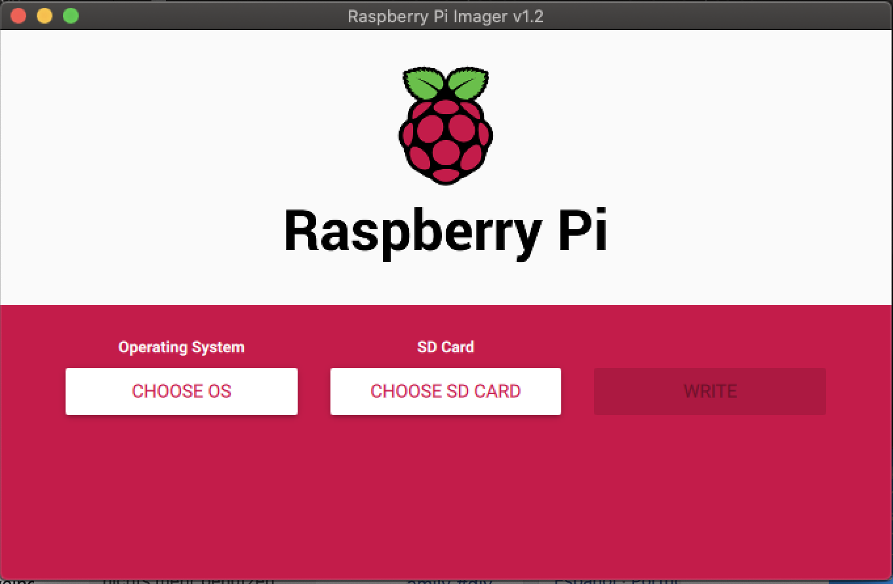
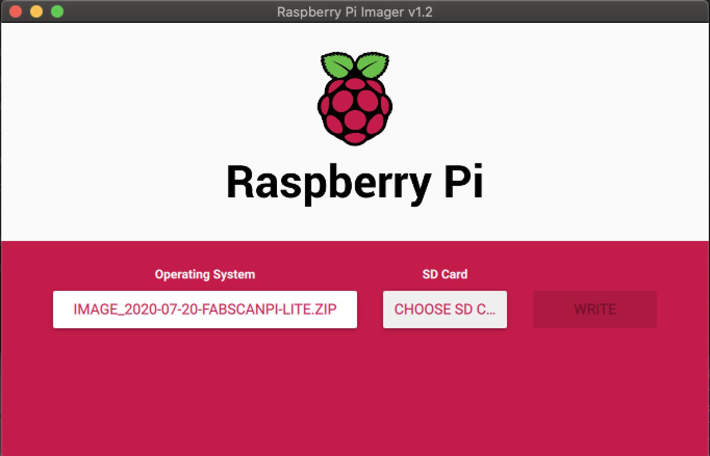
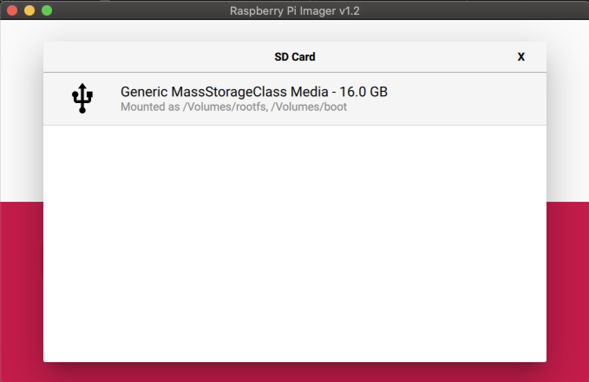
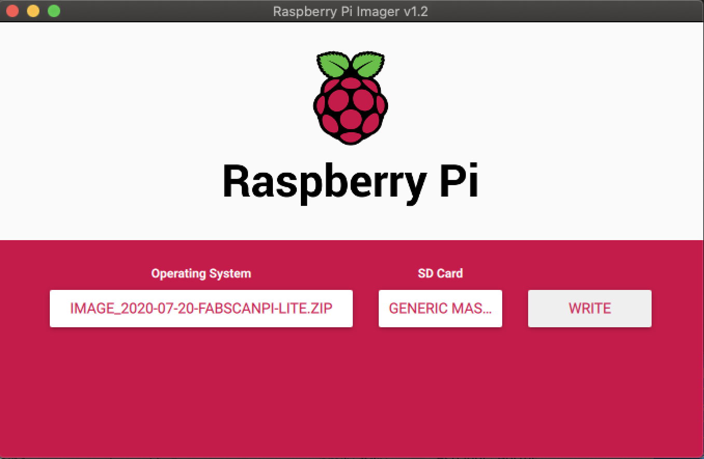
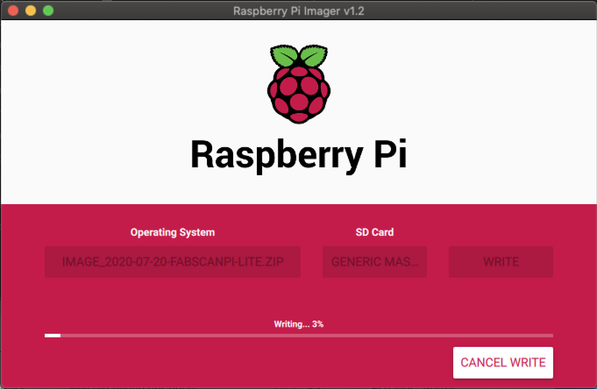

.. _software_installation:

***********************
Installing the Software
***********************

Installing FabScan OS
---------------------

The fastest way to start working with FabScan PI is to use the FabScan PI Raspberry OS Image.

For the installation you will need the following things:

- A computer with integrated or connected card reader
- A Micro-SD card with at least capacity of 8 GB

1. Download the latest Image
~~~~~~~~~~~~~~~~~~~~~~~~~~~~

You need to download the latest image of the FabScanPi Software.

`<https://fabscan.org/downloads/>`_

2. Install Raspberry Pi Imager
~~~~~~~~~~~~~~~~~~~~~~~~~~~~~~

Download and install the latest version of Raspberry Pi Imager from

`<https://www.raspberrypi.org/software/>`_

2. Writing the Image to SD
~~~~~~~~~~~~~~~~~~~~~~~~~~
Now insert the Micro-SD card into the card reader which is connected with your computer and start
the Raspberry Pi Imager software.

First you need to choose the downloaded FabScanPi SD-Card image. Just click on the "CHOOSE OS"
button which will open a dialog.

.. image:: images/Imager_system_list.png
   :alt: Raspberry Pi Imager choose Image

Scroll to the end of the list until you can see the entry named "Use custom". A click on this
entry opens a file dialog. Select the downloaded FabscanPi Image file. And confirm with "Ok".

.. note:: Naming convention of a FabScanPi Release file.

        **image_<release-year>-<release-month>-<release-day>-FabScanPi-lite.zip**

The file name should be shown as label of the button which was previously labeld with "CHOOSE OS".

Next you need to choose the SD-card where the image should be wirtten on. Click on the second button
which is labled with "CHOOSE SD CARD". A dialog with available devices/sd-cards appears.

Select your sd-card for the installation. Raspberry Pi Imager will return to the main view.
Finally click on the button labeled with "WRITE".

The writing process begins and it will show you a message when the process is finished.

If you want to use Wifi follow the Wifi Installation Guide, otherwise you can
remove the SD-Card form the SD-Card reader and insert it into the Raspberry Pi.

Now you can proceed with the next steps:

For :ref:`FabScanPi <fabscanpi-software-configuration>` based scanners.

For :ref:`Ciclop <ciclop-software-configuration>` based scanners

