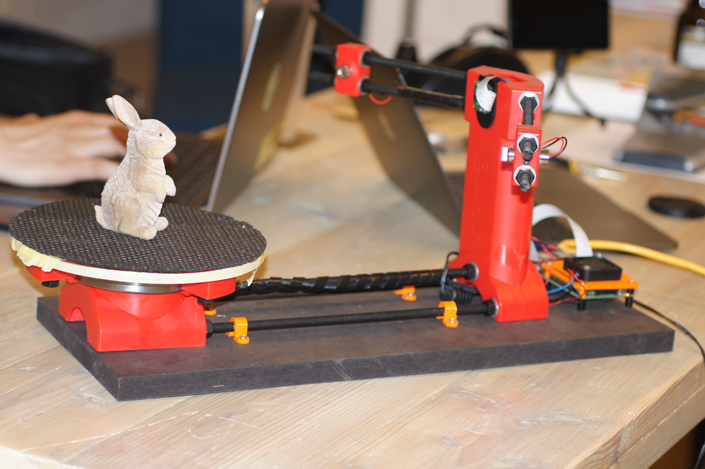
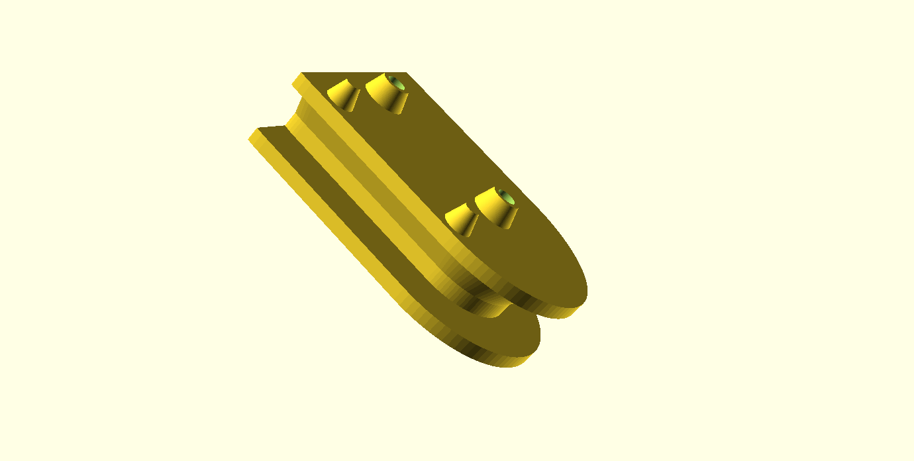
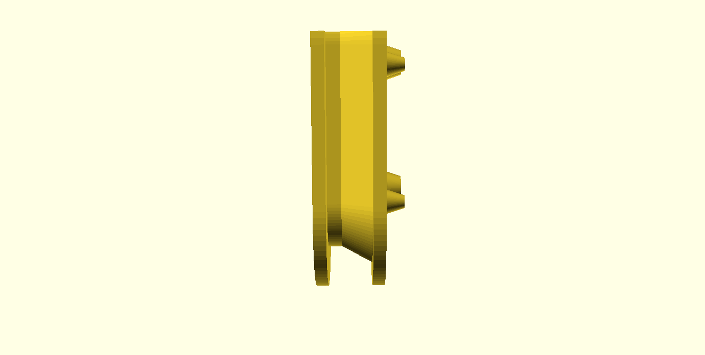
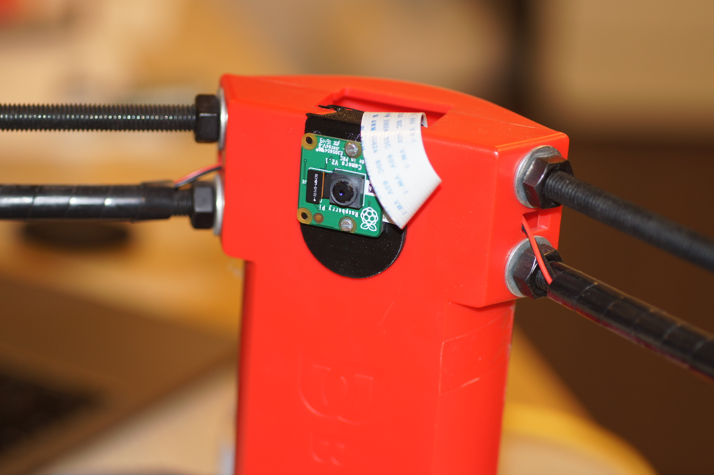
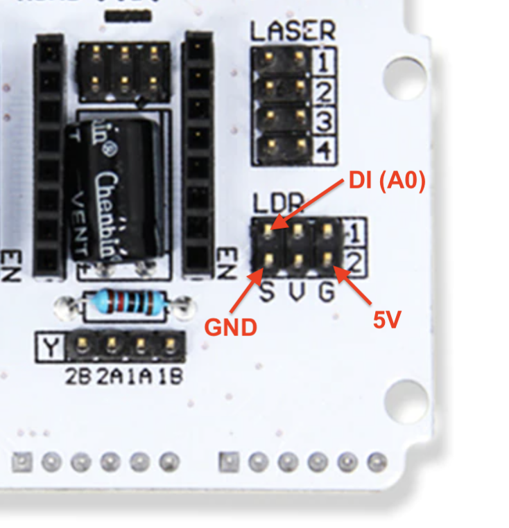

.. _steps_ciclop:

**************************
Ciclop based Laser Scanner
**************************

1. About Ciclop
---------------

2. Bill of Materials
--------------------

The following list shows what you need to modify the Ciclop scanner for using the FabScanPi Software.

**General components**

- `12V to 5V switching regulator <https://shop.watterott.com/V7805-2000-Step-Down-Schaltregler-5V-2A_1>`_
- `Raspberry Pi 3 B+ or higher <https://shop.watterott.com/Raspberry-Pi-3-Model-B-64Bit-12GHz-Quad-Core-ARM-Cortex-A53>`_
- `Raspberry Pi camera V2 <https://shop.watterott.com/Raspberry-Pi-Camera-v2-8MP>`_
- `Raspberry Pi Camera Connection Cable - 50cm <https://shop.watterott.com/Raspberry-Pi-Camera-Connection-Cable-50cm>`_
- Micro SD Card ( >= 8GB)
- Silent Step Stick Motor driver
- 3D printed Camera Mount
- 3D printed Raspberry Pi Mount

3. Ciclop Modification
----------------------

Mounting Raspberry Camera
~~~~~~~~~~~~~~~~~~~~~~~~~

You can use a printed camera mount to mount the Raspberry Pi Camera to the ciclop. The Raspberry Pi Camera will replace
the USB webcam.

.. note:: The Raspberry Pi camera has a better image quality than the ciclop USB webcam.

Replacing the Motor driver
~~~~~~~~~~~~~~~~~~~~~~~~~~

It is recommended to replace the default motor driver of the ciclop with a silent step stick driver.
You can use a TMC2100, TMC2208 or TMC2009. But you need to configure the TMC2xxx driver to run in 1/16
micro  stepping mode. If you decided to use the TMC2100 driver all you need to do is removing the jumpers
under the ciclop motor driver. For other TMC drivers read the `manual at watterotts TMC guide. <https://learn.watterott.com/silentstepstick/pinconfig/>`_

The motor driver which was included in the kit has a red or green surface.

.. image:: images/IMG_20180731_221906.jpg
   :width: 400

The picture shows a TMC2100 motor driver on the ciclop Arduino Shield.

.. image:: images/IMG_20180731_222322.jpg
   :width: 400

.. note:: You can also use the default driver, but the usage of a TMC motor driver lets the turntable move much more silent and smooth. That leads you to much better calibration and scan results.

Connecting Raspberry Pi
~~~~~~~~~~~~~~~~~~~~~~~

Connect the Ciclop Arduino USB cable to the USB port of the Raspberry Pi. Then connect the
Raspberry Pi camera ribbon cable to the Raspberry Pi.

.. image:: images/IMG_20190702_203623.jpg
   :width: 600

.. note:: You can use a Raspberry Pi camera ribbon cable extension (50 cm).

You can use a Ethernet cable for Network connection or configure the Raspberry Pi's wifi :ref:`setting-up-wifi`.

.. warning:: The Raspberry Pi 4 needs active cooling by a fan. Otherwise the scan process will stuck or fail.

Proceed with the Power Management.

The Power Management
~~~~~~~~~~~~~~~~~~~~

The fastest way is using two power supplies. One 5V supply for the Raspbbery Pi and a second one with 12V connected
to the Arduino for the motors.

.. warning:: Do not use the 5V supplied by the Arduino, because it does not supply enough current. The Arduino and even the Raspberry Pi may be demaged otherwise.

But if you want a setup with less wires, you should add a Step-Down converter like on the picture below.

.. image:: images/IMG_20190702_202402.jpg
   :width: 400

The 5V output of the Step-Down converter is connected to the 5V and GND pin of the Raspberry Pi.

.. image:: images/IMG_20190618_213807.jpg
   :width: 400

Connecting LEDs (WS2812)
~~~~~~~~~~~~~~~~~~~~~~~~

It is recommended to connect a WS2812 LED-Ring or some WS2812 LED stripes for a better illumination
of the object. You can use the 6 pin header on the original ciclop ZUM board.

5. Software Installation
------------------------
Now you need to install the FabScan sotware. Please follow the Guide for :ref:`software_installation`.

6. Software Configuration
-------------------------

.. _ciclop-software-configuration:

The image installation from the previous step already contains a default configuration for the FabScan.
But some values need to be adjusted, depending on your hardware setup. You should recap your motor type,
and the number of lasers at this point.

.. note:: If you don't know how to edit a file by using a text editor on a Raspberry Pi console,
   you should read detailed chapter on :ref:`how-edit-config` first..

**Motor Config**

You should be sure that the number of steps matches your motor. If you are using a NEMA17 motor, the common
number of steps for a full revolution is 200 (1.8 degree per step). The motor driver is set to 1/16 step what results in 16*200=3200 steps.
Most of the ciclop kits come with a 200 steps stepper motor.

.. warning:: It is important to set a correct value for your motor. A incorrect value can cause double/mirrored looking scans results.
   Even the calibration process might fail.

The example below shows a configuration for a 200 step stepper motor. The cilop turntable radius is 100mm. If you are using another
turntable than the default one, change the radius.

.. code-block:: JSON

    "turntable": {
        "steps": 3200
        "radius": 100,
        "height": 155
    }

**Laser Config**

Change the number of lasers to a number which matches your setup. If you are using just one laser then change numbers to 1,
otherwise numbers should be 2. And be sure that interleaved is set to true.

.. code-block:: JSON

    "laser": {
        "interleaved": "True",
        "numbers": 2,
        "color": "R (RGB)"
    }

**Serial Connection**

Be sure that the connector type is serial and the firmware is set to ciclop. The port should match the serial port
where the ciclop board is connected. Mostly the port is /dev/ttyUSB0. The baudrate should be set to 14400 for the ciclop.

.. code-block:: JSON

    "connector": {
        "type": "serial",
        "firmware": "ciclop",
        "baudrate": 14400,
        "autoflash": "True",
        "port": "/dev/ttyUSB0",
        "flash_baudrate": 115200
    }

**Calibration config**

You need to change the calibration board config to the ciclop calibration board values.

.. code-block:: JSON

        "pattern": {
            "square_size": 13,
            "rows": 6,
            "columns": 10,
            "origin_distance": 35
        },

.. note:: Read more about the calibration configuration in the advanced :ref:`software_configuration` section.

Leave the rest of the file as it is.

7. Using the Software
---------------------
You can proceed with the software :ref:`software_first_steps` .
A more complete software manual can be found in the section :ref:`software_usermanual`.
Don't miss to read the section about :ref:`scanner_calibration`.

.. note:: A precise calibration is the key for good scan results!