.. _steps_fabscanpi:

***********************
FabScanPi Laser Scanner
***********************

1. Bill of Materials
--------------------

The following list shows what you need to build a FabScan.

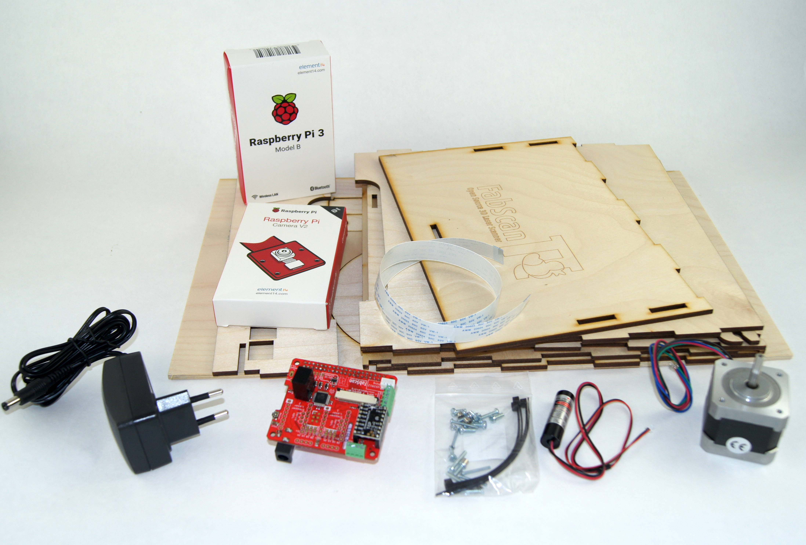

**General components**

- `Stepper Motor, NEMA 17 type, 1.8° step angle (200 steps/revolution) <https://shop.watterott.com/Stepper-Motor-NEMA-17-400-Steps-42x34mm-2V-17A>`_
- Pololu Universal Aluminum Mounting Hub for 5mm Shaft, with M3 holes
-  Motor driver (`Silent Step Stick <https://shop.watterott.com/SilentStepStick-TMC2100-5V_1>`_ recommended)
- `5V red line laser module <https://shop.watterott.com/Line-laser-red-1mW-adjustable-focus>`_ (second laser optional)
- `FabScanPi HAT <https://shop.watterott.com/RPi-FabScan-HAT-for-FabScan-Pi-3D-Scanner-Project>`_ for Raspberry Pi
- `12V to 5V switching regulator <https://shop.watterott.com/V7805-2000-Step-Down-Schaltregler-5V-2A_1>`_
- `Raspberry Pi 3 B+ <https://shop.watterott.com/Raspberry-Pi-3-Model-B-64Bit-12GHz-Quad-Core-ARM-Cortex-A53>`_
- `Raspberry Pi camera V2 <https://shop.watterott.com/Raspberry-Pi-Camera-v2-8MP>`_
- `Raspberry Pi Camera Connection Cable - 50cm <https://shop.watterott.com/Raspberry-Pi-Camera-Connection-Cable-50cm>`_
- `FabScanPi Camera Mount <https://shop.watterott.com/Raspberry-Pi-Camera-Ring-Light-JST>`_ with LED ring
- `FabScanPi Case <https://shop.watterott.com/FabScan-Pi-Housing-Parts-V2>`_, source files available `here <https://github.com/mariolukas/FabScan-Case>`_
- `Screw Set <https://shop.watterott.com/FabScan-Pi-Schraubensatz_1>`_ or see the `Screws and Washers <#screws-and-washers>`_ table
- 1x 12V / 3A power supply 
- Micro SD Card ( >= 8GB)

Even if you use the screw set from Watterott, as given in the *BOM*, here is the the usage reference:

**Screws**

+------+--------+------+-------------------------+
| Type | Length | Qty  | Usage                   |
+------+--------+------+-------------------------+
| M2   | 16     | 2    | Security Switch         |
+------+--------+------+-------------------------+
| M2.5 | 15     | 4    | RaspberryPi             |
+------+--------+------+-------------------------+
| M3   | 10     | 4    | Stepper motor           |
+------+--------+------+-------------------------+
| M3.5?| ?      | 4    | RPi-RingLight           |
+------+--------+------+-------------------------+
| ?    | ?      | 4    | Turn-table Mounting Hub |
+------+--------+------+-------------------------+

**Washers**

+---------+--------+------+---------------+
| Type    | Heigth | Qty  | Usage         |
+---------+--------+------+---------------+
| 3.4/4.5 | 1      | 4    | Stepper motor |
+---------+--------+------+---------------+
| 2.5/4.5 | 3      | 4    | RaspberryPi   |
+---------+--------+------+---------------+

2. Assembly of the Scanner
--------------------------

Assembly of the lid
~~~~~~~~~~~~~~~~~~~

Start with the lid. Just glue the small bridge parts to the biggest (top) part.

**Step 1:**

.. image:: images/case_step_1.jpg
   :width: 600

**Step 2:**

.. image:: images/case_step_2.jpg
   :width: 600

.. note:: It is helpful to use some tape for holding parts in place until the glue is hardened

    .. image:: images/gehause_schritt_10.jpg
       :width: 400

Then add the front part.

**Step 3:**

.. image:: images/case_step_3.jpg
   :width: 600

Finish the lid assembly by gluing the handle to the front part.

**Step 4:**

.. image:: images/case_step_4.jpg
   :width: 600

You can now put the lid aside. Let the glue harden and proceed with the box.

**Step 5:**

.. image:: images/case_step_5.jpg
   :width: 600

Assembly of the box
~~~~~~~~~~~~~~~~~~~

First assemble the base part of the box.

**Step 6:**

.. image:: images/case_step_6.jpg
   :width: 600

The holes in the front part should point to the right side of the box.
You can find small marks labeled with RF (right front) and LF (left front) on the bottom of the front part.

.. note:: The side parts are not symmetrically. You can use the engravings for finding the correct alignment of the side parts.
    Where RF means right front, and LF means left front.

    .. image:: images/gehause_schritt_beschriftung.jpg
       :width: 400

**Step 7:**

.. image:: images/case_step_7.jpg
   :width: 600

Proceed with gluing the back wall to the box.

**Step 8:**

.. image:: images/case_step_8.jpg
   :width: 600

Now you can add the right side part. Keep attention to the marks labeled RF (right front).

**Step 9:**

.. image:: images/case_step_9.jpg
   :width: 600

Finally add the left side part to the box.

**Step 10:**

.. image:: images/case_step_10.jpg
   :width: 600

The finished case should look like on the picture bellow.

**Step 11:**

.. image:: images/case_step_11.jpg
   :width: 600

Assembly of the laser mounts
~~~~~~~~~~~~~~~~~~~~~~~~~~~~

Now you can proceed with the laser mounts. You can use the interlocks to tack the parts together.

**Step 12:**

.. image:: images/case_step_12.jpg
   :width: 600

Repeat this step also for the second laser mount.

**Step 13:**

.. image:: images/case_step_13.jpg
   :width: 600

Assembly of the turntable
~~~~~~~~~~~~~~~~~~~~~~~~~

The turntable consists of two parts. The part with the bigger holes is the top part.
The one with the smaller holes is the bottom part. Glue the top turntable part onto
the bottom part.

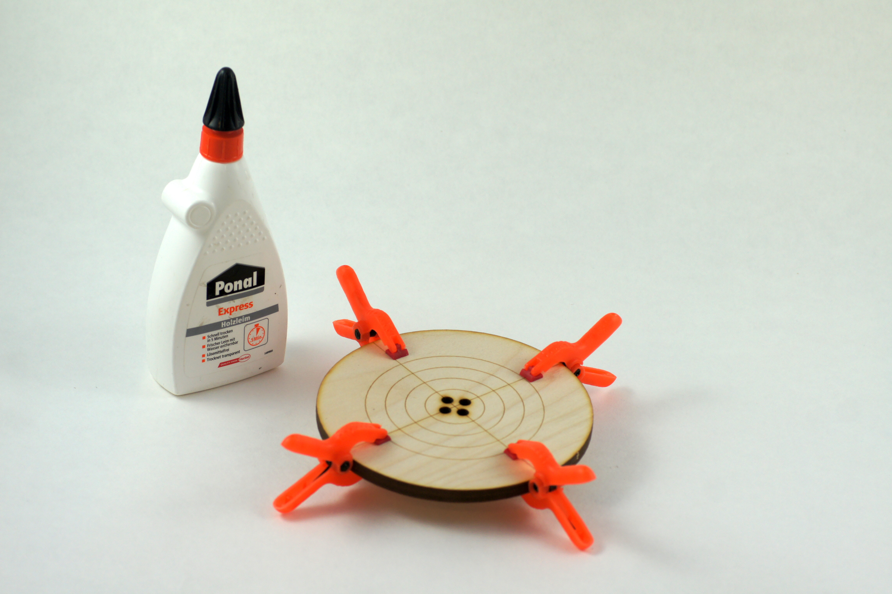

Be sure that the holes match like on the picture below. The big holes are needed as
a sink for the screws.

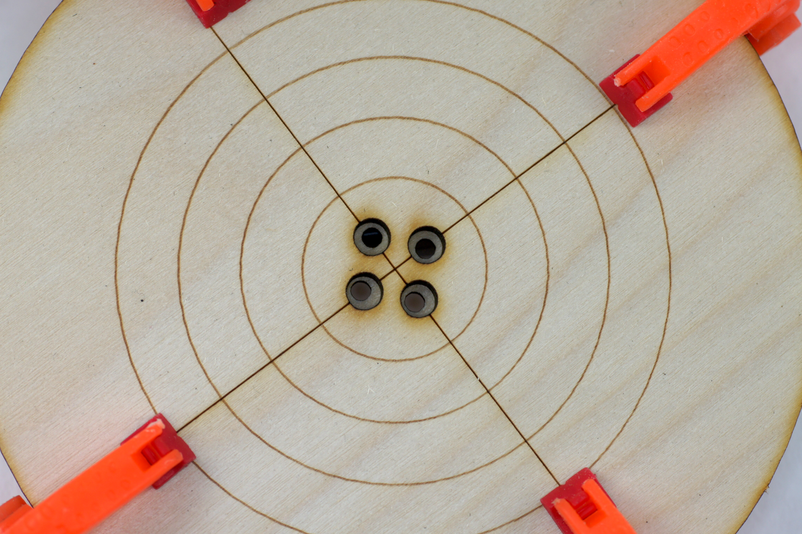

.. note:: Use some clamps to hold both turntable parts in position until the glue is hardened.

Assembly of the Camera
~~~~~~~~~~~~~~~~~~~~~~

This small manual will help you to assemble the Camera and LED ring combination. You will need a light if you want to perform texture scans (Check mark is set for Color Scan).

.. image:: images/RingLicht_1.jpg
   :width: 400

This is how it should look like if you finished the assembly.

The Ring-Light will include the parts you can see in the next picture below (the camera modul is sold separately):

.. image:: images/RingLicht_1b.jpg
   :width: 400

.. warning:: You will need the standard camera modul (which has a green pcb). The black module used in the pictures is the IR version which has the same dimensions but different optical specifications.

.. note:: The default camera ribbon cable needs to be replaced by the longer one (50cm)

    .. image:: images/camera_2.JPG
       :width: 400

Slide one end of the flat ribbon cable into the connector of the camera module (1). Make sure the blue plastic is on the side facing away from the camera. Push the lock bar of the connector gently into the lock position (2).

.. image:: images/RingLicht_2.jpg
   :width: 400

Merge the flat ribbon cable through the elongated hole in the LED board.

.. image:: images/RingLicht_3.jpg
   :width: 400

Put the four Screws through the holes in the camera board. The heads must be on the side where the lens is situated. Then put a spacer on every screw (as shown in the next picture).

.. image:: images/RingLicht_4.jpg
   :width: 400

Put the Camera modul on the LED board. All four screws must fit the appropriate hole. This can be a bit tricky but it is doable.

.. image:: images/RingLicht_5.jpg
   :width: 400

Put a nut on each screw an pull them hand-tight.

.. image:: images/RingLicht_6.jpg
   :width: 400

Now the Camera-LED assembly is ready for installation.

.. note:: The pins of the JST connector on the LED board have the following configuration:

    .. image:: images/JST-LEDboard-Configuration.jpg
       :width: 400

Mounting the Camera
~~~~~~~~~~~~~~~~~~~
Now mount the assembled LED-Ring with the Raspberry Pi camera module to the FabScanPi enclosure.
The ribbon cable should point to the back wall. Use 4 3mm screws and nuts to attach the Led-Ring PCB to the
side wall.

.. note:: The thread of the screws should point to the inside of the enclosure. This prevents the screws to
   get stuck to something outside of the enclosure.

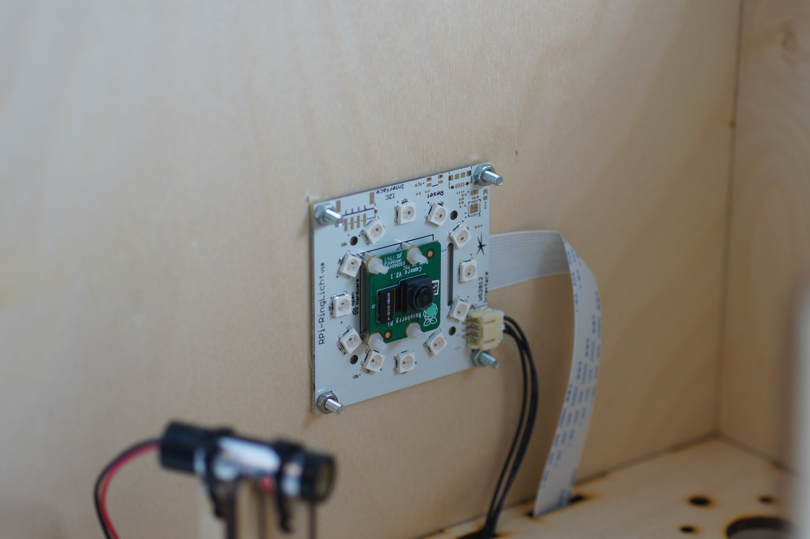

Mounting the Motor
~~~~~~~~~~~~~~~~~~

Attach the motor to the box. Use four 3mm screws. The motor needs to be attached from the
bottom side of the box. Tighten the screws from the inner side of the box.

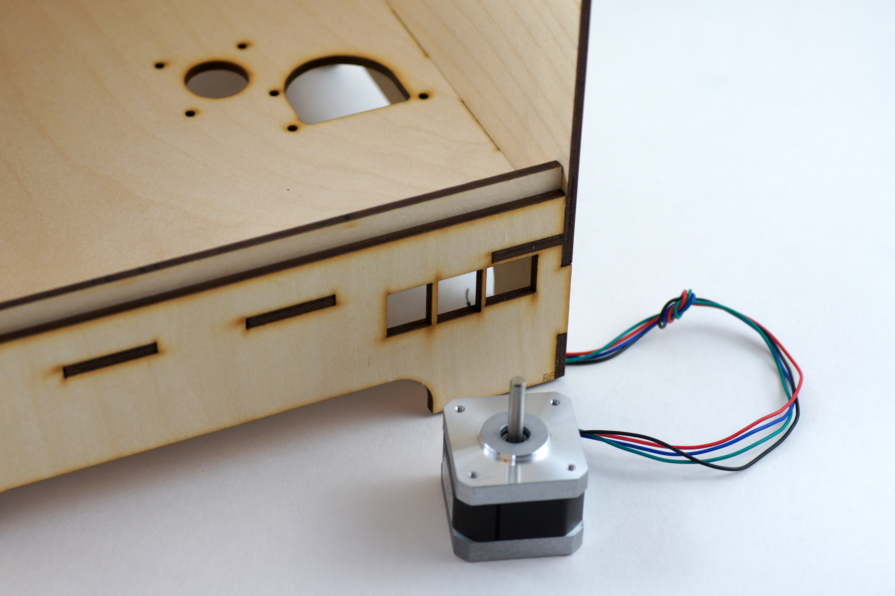

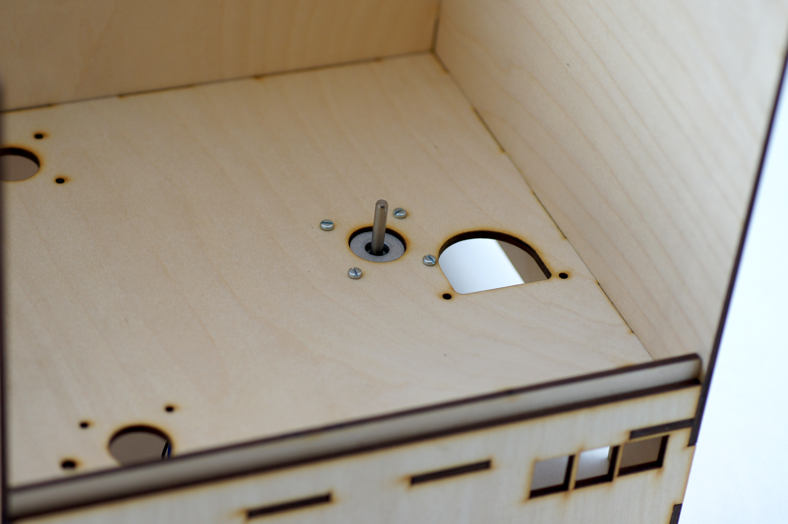

The motor wires should point to a direction where you can easily connect them to the HAT (later).
Best practice is to let the wires point into the inside of the box.

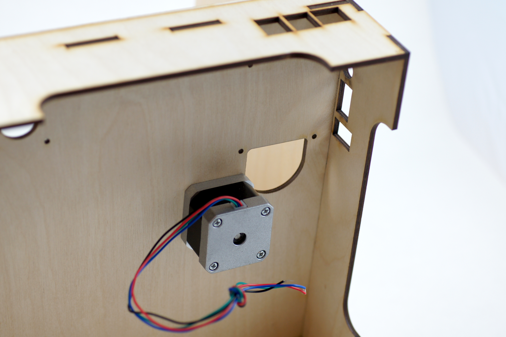

Mounting the turntable
~~~~~~~~~~~~~~~~~~~~~~

Before mounting the turntable you need to mount the flange to the motor shaft. You should leave at least
about 5mm from the top of the shaft (the thickness of one turntable sheet). Gently tighten the grub screw to
keep the flange in position.

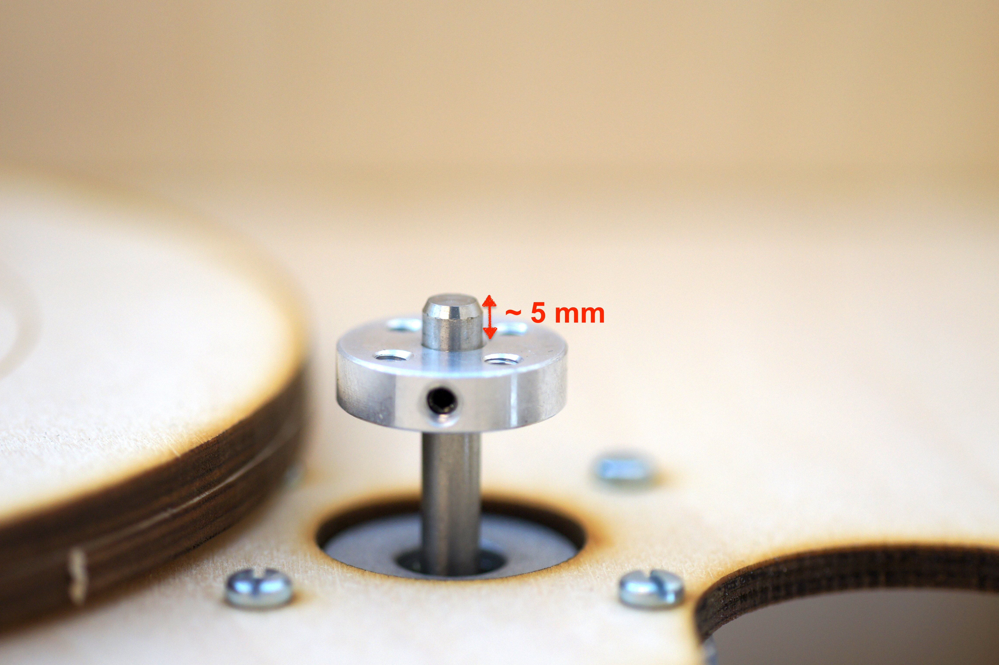

Afterwards screw the assembled turntable on the flange. You should use all 4 screws!

.. note:: Be sure that the table doesn't wobble. Otherwise you need to mount the flange higher/lower to the shaft.

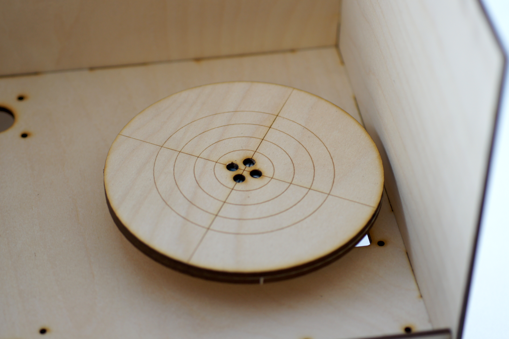

Mounting the Lasers
~~~~~~~~~~~~~~~~~~~

The laser mounts can be pressed gently into the holes on the bottom plate of the enclosure.
Mount the lasers with zip ties onto the laser mounts. Finally push the laser cables through the holes on the bottom plate behind the lasers.

.. image:: images/case_step_14.jpg
   :width: 600

Mounting the Raspberry Pi
~~~~~~~~~~~~~~~~~~~~~~~~~

It is time to mount the Raspberry Pi underneath the bottom plate of the enclosure. Use four spacer sleeves
and four screws with nuts. The network and USB connectors should point to the front of the enclosure.

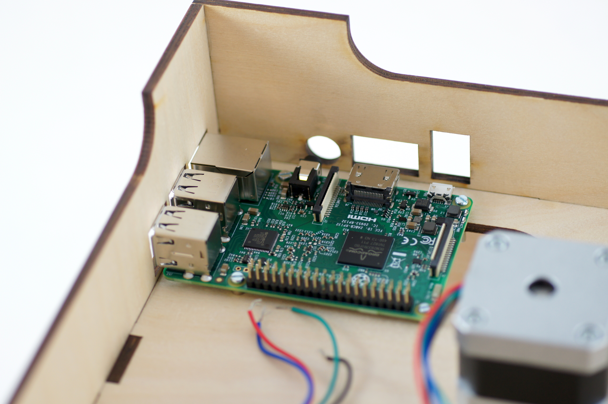

The threads of the screws should point to the inside of the enclosure.

.. note:: The big hole behind the Raspberry Pi just makes the SD-Card changing easier.

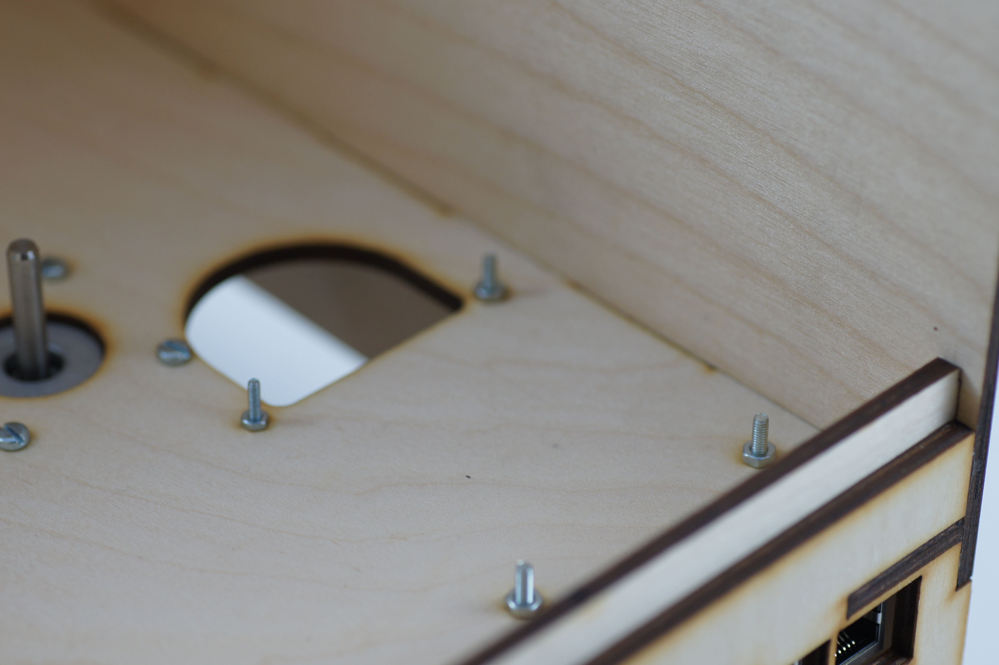

The FabScanPi HAT
~~~~~~~~~~~~~~~~~

.. note:: About soldering: If you are soldering for the very fist time, we suggest to read the comic `"Soldering is Easy" <https://mightyohm.com/files/soldercomic/FullSolderComic_EN.pdf>`_ by Mitch Altman (soldering wisdom), Andie Nordgren (comic adaption) and Jeff Keyzer (layout and editing).

.. image:: images/RPi-FabScan-HAT05.jpg
   :width: 600

You can follow the steps in the assembly video on Youtube by Rene Bohne.

.. raw:: html

    <iframe width="560" height="315" src="https://www.youtube.com/embed/DogfNxk277Y" frameborder="0" allowfullscreen></iframe>

You only need to install the headers and connectors which fit your demand. The following guide will show the assembly of the
minimal configuration.

.. note:: The HAT can handle up to 3 stepper motors and/or 3 stepper motors. But the software does only support one stepper
   motor by now.

The first connector is the JST connector for the RPi-RingLight. Make sure the direction is correct. Fix it and solder the three pins on the rear side of the PCB.

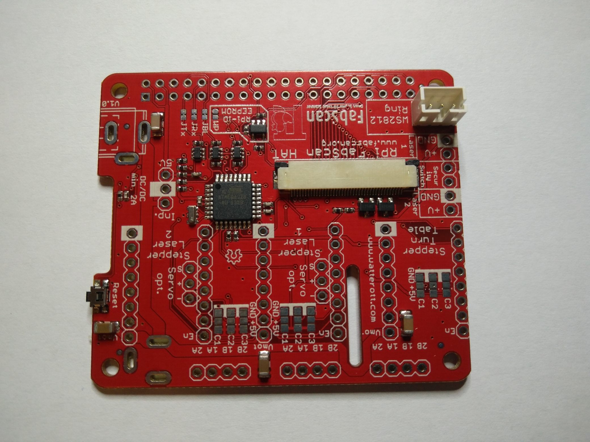

After the JST Connector is soldered on the PCB, you can proceed with the green screw terminals. Only two of them are needed for
the minimal requirements. The one with the 6 screws (for lasers and safety switch), and one with 4 screws for the stepper motor
wires.

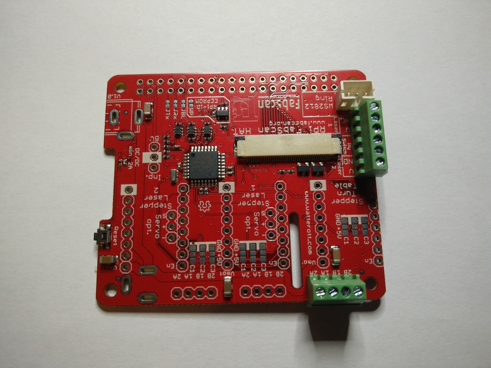

Now you can solder the 40 pin Raspberry Pi connector to the PCB. Double check all solder joints before you will continue with
the next step.

.. image:: images/IMG_20160810_011820.jpg
   :width: 600

.. warning:: The Step-Down converter needs to be soldered on the PCB in the correct direction! Otherwise it will damage your
   HAT and the Raspberry Pi. It is better to double check the direction before soldering. The small white dot on the left side
   of the component needs to be on the same side as the Power Jack.

   .. image:: images/fabscanpihat_12to5.png
      :width: 300

   .. image:: images/RPi-FabScan-HAT15.jpg
      :width: 300

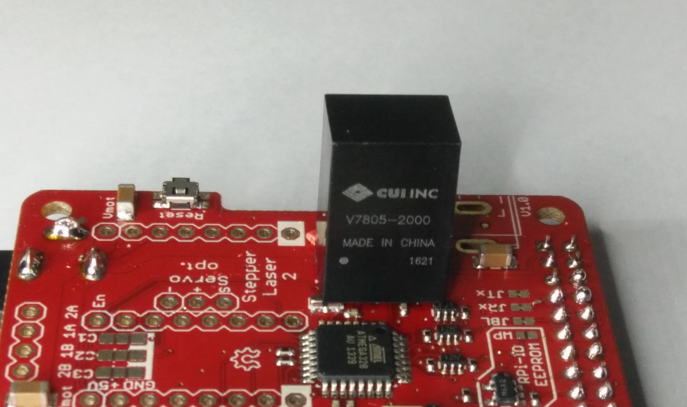

.. warning:: The V7805-2000 Step-Down converter does provide a max. of 2000 mA. You should not use the V7805-2000 with the
   a Raspberry Pi4, because the Raspberry Pi4 needs at least 3000 mA or more. In that case you can
   work with two power supplies, 5V USB for the pi and 12V for the motors connected to the HAT's DC-jack power connector. Or just find another Step-Down
   converter and connect it with some wires to the HAT.

Now the DC-jack power connector will be installed into three oval pin holes across from the 2x20-pin socket header. Soldering is done from the top side of the PCB.

.. image:: images/IMG_20160810_012318.jpg
   :width: 600

.. note:: The center pin is for +12V DC, the outer connector tongue is for GND.

    .. image:: images/Power_Connector_HAT.jpg
       :width: 400

The finished HAT should look like on the following picture.

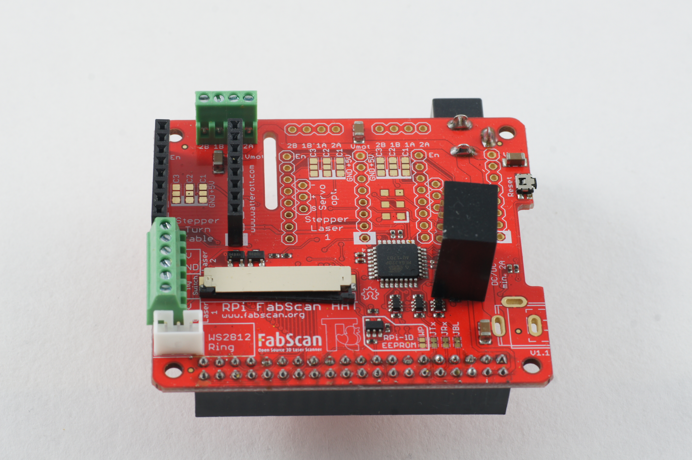

Assemble Motor drivers
~~~~~~~~~~~~~~~~~~~~~~

There are different kinds of motor drivers. The kit is delivered with a TMC Silent Step stick.
The version which is included in the kit changed over time. You will find a TMC2100, TMC2208
or a TM2209.

Check if your drivers are delivered pre-soldered, which means that all the pin-headers are already
soldered to the PCB. Otherwise solder the headers to your driver.

.. warning:: If you need to solder the pin-headers to your driver, keep attention on the labels
   top and bottom. Have a look at the image below.

    .. image:: images/silentstepstick-tmc2208-verloetet.jpg
       :width: 400

Find out which driver is included in your FabScanPi kit. If you are not sure you can use `Watterotts
comparison list <https://learn.watterott.com/silentstepstick/comparison/>`_ to match your driver.

Now you need to configure your driver for 1/16 micro stepping mode. This can be done by some jumper
configurations on the HAT, but it depends on the driver you are using. Choose the option which matches
your Silent StepStick driver

**TMC2100**
The HAT was made for the TMC2100 when the FabScanPi project was started. There is nothing to do
because the HAT is already configured for this driver. You can proceed with `Wiring all Components`_

**TMC2208**

You need to connect CFG2/MS2 and CFG1/MS1 pins of the driver to VIO (5V of the HAT).
This can be done by soldering some bridges (yellow mark) on the HAT like marked on the picture below.

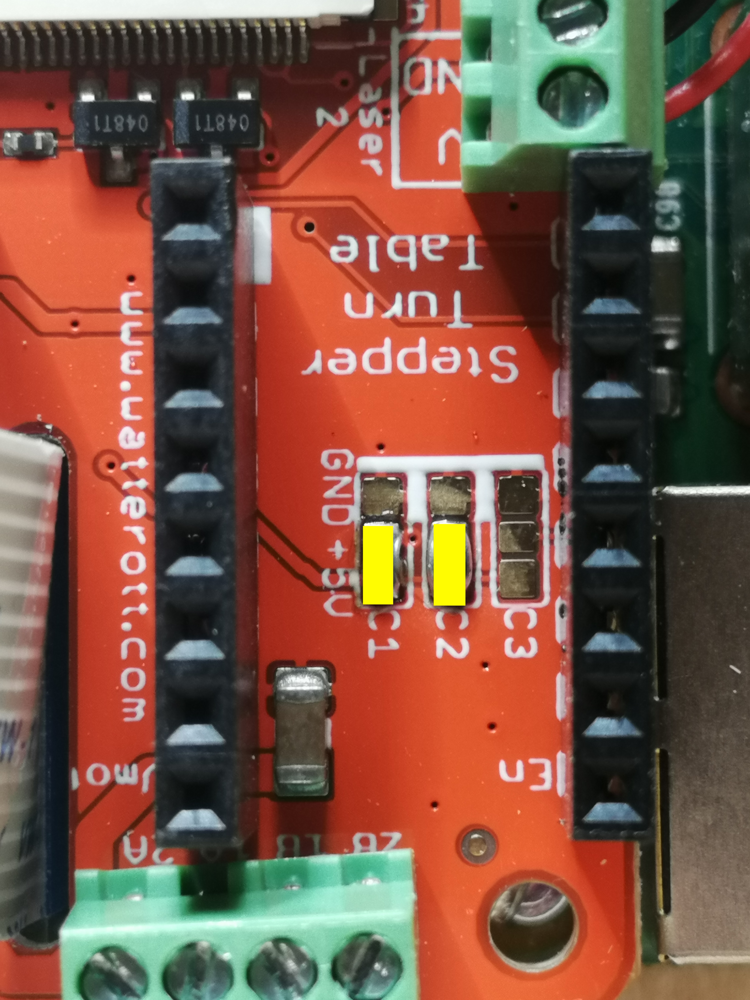

**TMC2209**

You need to connect CFG2/MS2 and CFG1/MS1 pins of the driver to VIO (5V of the HAT) and SPREAD/MS3 to GND.
This can be done by soldering some bridges (yellow mark) on the HAT like marked on the picture below.

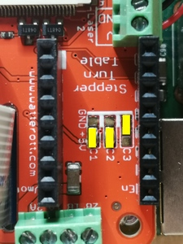

.. warning:: Be careful while soldering those bridges. Prevent to bridge other pads than those in the pictures.
   Bridging the wrong pads may result in unexpected behaviour.

.. note:: You can find more information about the different driver configurations in the official
   Silent Step-Stick documentation for `TMC2100 <https://learn.watterott.com/silentstepstick/pinconfig/tmc2100/>`_, `TMC2208 <https://learn.watterott.com/silentstepstick/pinconfig/tmc2208/>`_ and `TMC2209 <https://learn.watterott.com/silentstepstick/pinconfig/tmc2209/>`_

Wiring all Components
~~~~~~~~~~~~~~~~~~~~~

Before wiring up all components, you need to attach the HAT on the Raspberry Pi. Keep in mind to
thread the camera ribbon cable through the elongated hole on the HAT before attaching the HAT to the
pi.

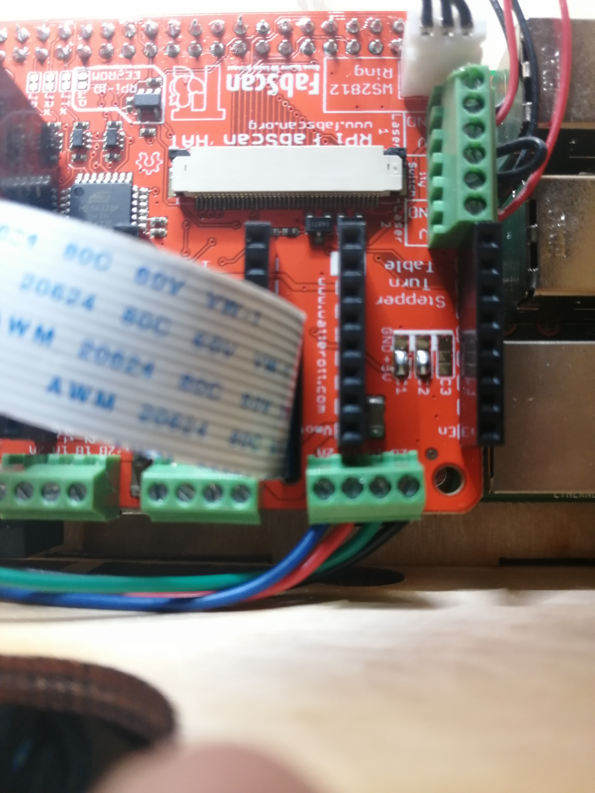

When the HAT is attached on the Raspberry Pi you can proceed with the rest of the wiring.

**Wiring of the Motors**

First identify your motor. The kit was delivered with one of the following motors:

**17HM3410 (400 steps per full turn)**

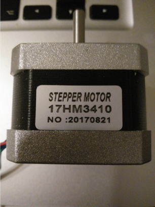

Coil1: Black, Green and Coil2: Red, Blue

**SY42STH38-1684A (200 steps per full turn)**

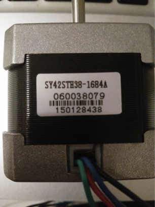

Coil1: Black, Green and Coil2: Red, Blue

Connect the motor wires like in the picture below.

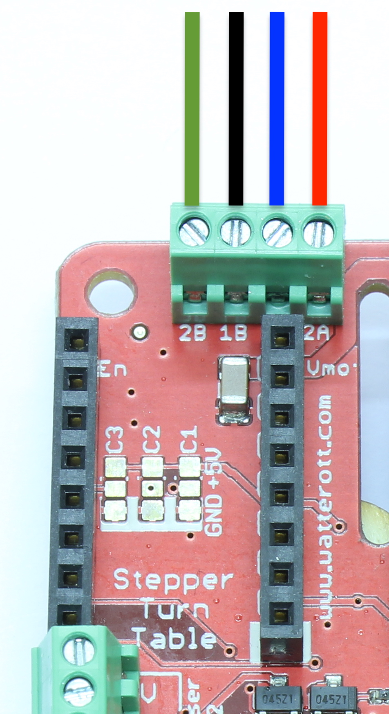

Both have the same color scheme for wiring. But keep in mind that one motor comes with 200 steps
and the other with 400 steps. This will be important when you proceed with the section
`4. Software Configuration`_

.. note:: If you are not sure which motor you are using, you can also proceed with one of the
    following methods to find the correct motor coil pairs.

    There are different kinds of stepper motos. Mostly with 4 or 6 leads. For
    connecting the stepper motor to the FabScanPi HAT you need to know the
    corresponding lead pairs of the motor coils. The best way to find out something
    about the motor is to have a look at the datasheet of the motor manufacturer.
    In the following desciptions the pairs are called (2B, 1B) and (1A, 2A).

    .. image:: images/4wires.jpg
       :width: 400
    .. image:: images/6wires.jpg
       :width: 400

    .. image:: images/hat_wires.jpg
       :width: 400

    There are several ways to find the pair wires without a datasheet. Some of them
    are described here:

    **Method with an ohm-meter**

    Simply measure pairs of wires for their resistance. If the resistance is a few ohms
    ( < 100 Ω) only, you've found a pair. The other two wires should make up the other pair.

    **Methods without an ohm-meter (feel the force)**

    First, try turning the motor with your fingers, and notice how hard it is. Then,
    stick wires together in pairs. If the motor turns noticeable harder, you've found a pair.

    **Methods without an ohm-meter (using a led)**

    Another method is to use an LED, hold any two wires to the ends of a LED and turn the
    motor (twiddle in both directions), the LED will light if the wires are a pair,
    swap wires until you light the LED.

**Attaching the Motor driver**

The motor driver can now be attached on the HAT. The outer pins VM and EN should point in the direction of the
Screw Terminal.

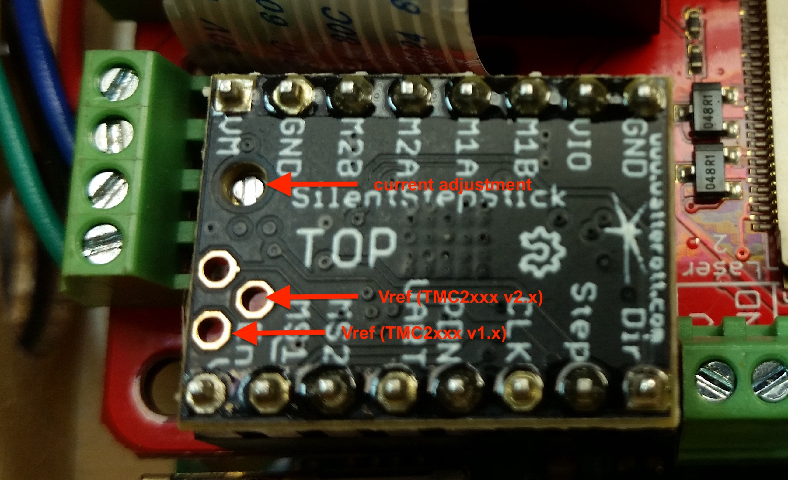

.. note:: The motor should be set to the correct current level, otherwise the motor will overheat, loss
   steps or even wobble. A good starting value for VRef is ~0.7V. You can find detailed instructions at
   `Watterotts F.A.Q. <https://learn.watterott.com/silentstepstick/faq/#how-to-set-the-stepper-motor-current>`_

.. warning:: The current poti is very sensitive. Never adjust the current without measuring against Vref. Turn the poti
   very gently, because a small change might have a big impact on the current level.

**Mechanical Laser Switch**

There is a safety switch feature available on the HAT. You can connect a switch which will
turn off the laser when the Lid of the scanner is opened. But the switch is not included in
the kit. You need to bridge the switch terminal connector, otherwise the lasers will not work.

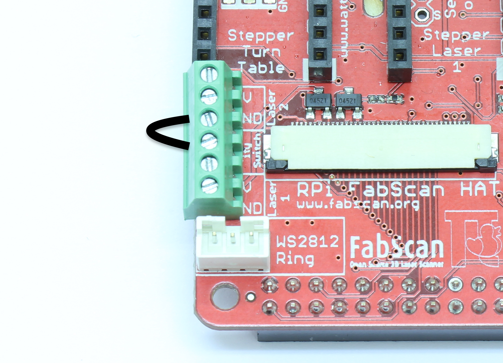

.. note:: It is recommended to install a switch which is handled by the lid, instead of just bridging the terminal connection.

**Wiring the Lasers**

If your kit has only one laser, connect only Laser 1, otherwise connect both lasers like on the picture below.

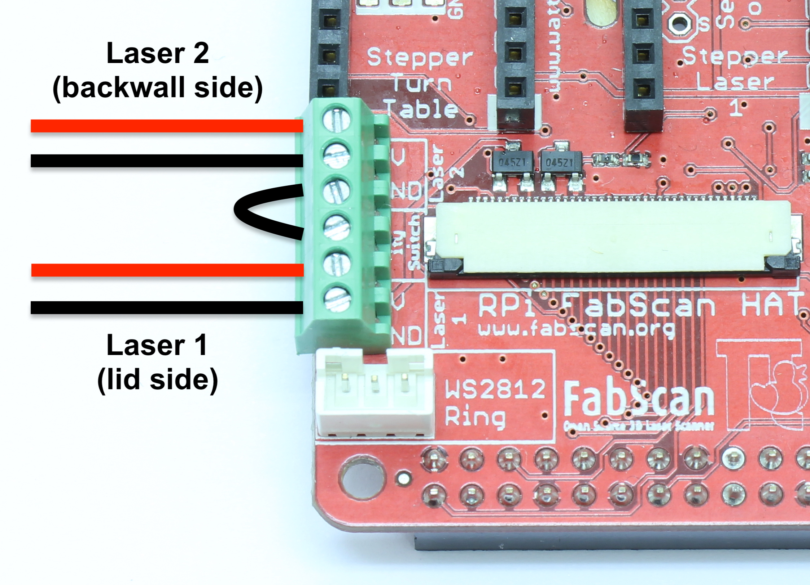

**Wiring the LED Ring**

Just connect the cable with JST connectors between the HAT and the LED-Ring PCB.

.. note:: The JST cable is short but it does exactly fit.

The complete wiring on the Raspberry Pi side should look like on the picture.

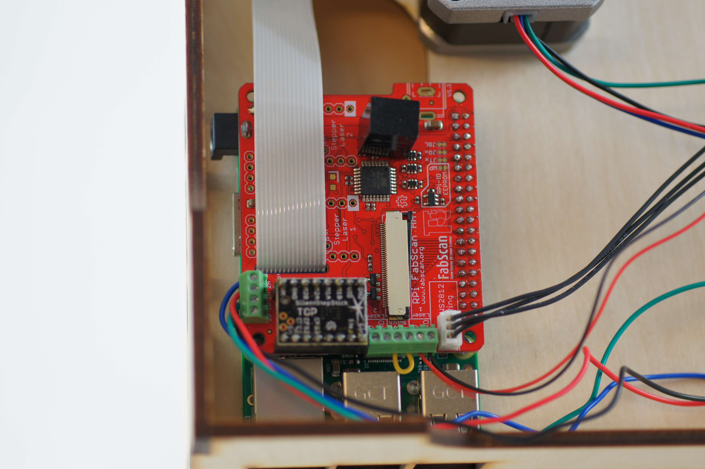

3. Software Installation
------------------------

Now you need to install the FabScan sotware. Please follow the Guide for :ref:`software_installation`.

4. Software Configuration
-------------------------

.. _fabscanpi-software-configuration:

The image installation from the previous step already contains a default configuration for the FabScan.
But some values need to be adjusted, depending on your hardware setup. You should recap your motor type,
and the number of lasers at this point.

.. note:: If you don't know how to edit a file by using a text editor on a Raspberry Pi console,
   you should read detailed chapter on :ref:`how-edit-config` first..

**Motor Config**

Lets start with the correct motor setting. You need to change the number of steps. This value should
match your motor. If you are using a 400 step motor you should use 6400 steps, otherwise use 3200 steps.

.. warning:: It is important to set a correct value for your motor. A incorrect value can cause double/mirrored looking scans results.
   Even the calibration process might fail.

The example below shows a configuration for a 200 step stepper motor.

.. code-block:: JSON

    "turntable": {
        "steps": 3200
        "radius": 70,
        "height": 155
    }

**Laser Config**

Change the number of lasers to a number which matches your setup. If you are using just one laser then change numbers to 1,
otherwise numbers should be 2.

.. code-block:: JSON

    "laser": {
        "interleaved": "False",
        "numbers": 2,
        "color": "R (RGB)"
    }

**Serial Connection**

Be sure that the connector type is serial and the firmware is set to fabscanpi.

.. code-block:: JSON

    "connector": {
        "type": "serial",
        "firmware": "fabscanpi",
        "baudrate": 115200,
        "autoflash": "True",
        "flash_baudrate": 115200,
        "port": "/dev/ttyAMA0"
    }

Leave the rest of the file as it is.

5. Using the Software
---------------------
You can proceed with the software :ref:`software_first_steps` .
A more complete software manual can be found in the section :ref:`software_usermanual`.
Don't miss to read the section about :ref:`scanner_calibration`.

.. note:: A precise calibration is the key for good scan results!
